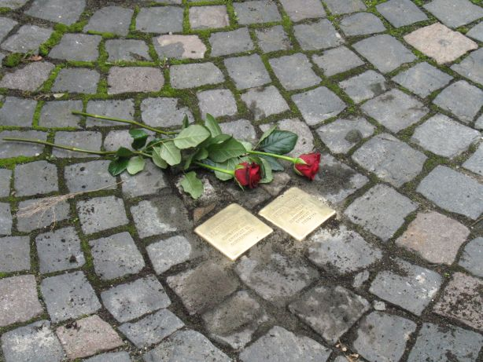
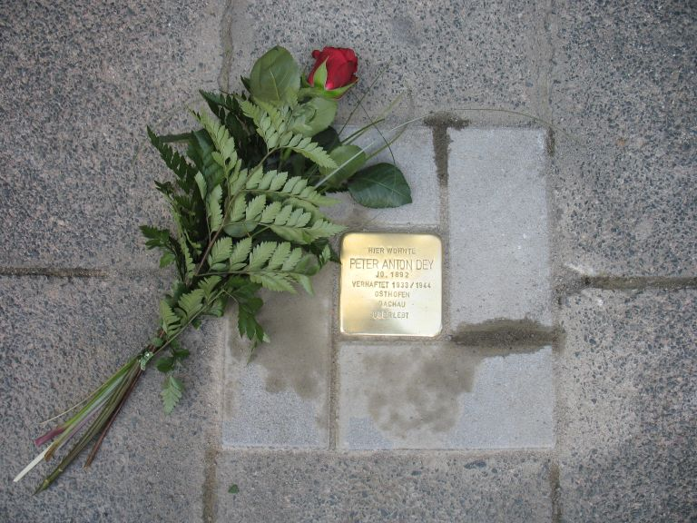
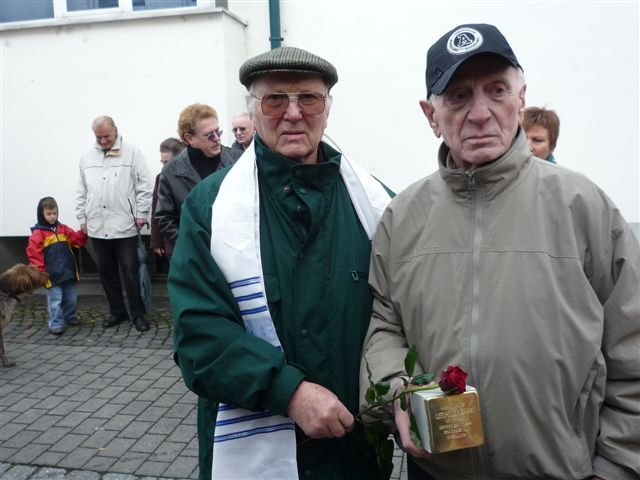

# Stolpersteine in Mühlheim am Main

> Ein Mensch ist erst vergessen, wenn sein Name vergessen ist (Talmud)

## Was sind "Stolpersteine"?

"Stolpersteine" halten die Erinnerung an die Vertreibung und Ermordung von Juden, Roma und Sinti, politisch Verfolgten, Homosexuellen, Zeugen Jehovas und Euthanasieopfern im Nationalsozialismus lebendig. Weitere Informationen finden Sie auf [www.stolpersteine.com](http://www.stolpersteine.com/).

### Die Steine

 

"Stolpersteine" sind kleine schlichte Betonwürfel (10x10x10 cm) mit Gedenktafeln aus Messing, die vor dem letzten selbstgewählten Wohnort des jeweiligen NS-Opfers in den Bürgersteig eingelassen werden.

Der Kölner Künstler und Bildhauer Gunter Demnig verlegte seit 1997 in deutschen und mittlerweile auch in europäischen Städten über 20.000 "Stolpersteine", über die Passanten im übertragenden Sinne "stolpern".

## Stolpersteine in Mühlheim am Main

### Entstehung

Am 28. November 2008 wurde die IG Stolpersteine im NaturFreundeHaus Mühlheim am Main gegründet. Gründungsmitglieder waren:
- Gerd Katzmann (NaturFreunde Mühlheim)
- Jörg Neumeister-Jung
- Hans Stier (NaturFreunde Mühlheim)
- Helmut Wäscher (NaturFreunde Mühlheim)
- Hans C. Schneider (Friedrich-Ebert-Gymnasium, Gründer der Auschwitz-AG)

Barbara Leissing von der Geschichtswerkstatt Offenbach am Main stand dem Quintett bei den ersten Schritten zur Seite.

### Bedeutung für Mühlheim

"Stolpersteine" ermöglichen einen neuen Zugang zu einem dunklen Kapitel der Geschichte von Mühlheim am Main. Was bisher im Geschichtsunterricht nur durch Zahlen und Fakten erfahrbar war, wird durch die Steine im Stadtgebiet zu einem bewussten Nachdenken über das Leben und Leiden der Opfer führen. Es waren Menschen wie du und ich, an die mit den knappen Inschriften auf den Steinen erinnert wird.

Die NaturFreunde Mühlheim haben bisher 19 Stolpersteine verlegt. Bis auf einen sind alle Steine für Juden aus der Heimatstadt. Leider ist es bisher nicht gelungen, auch an die Familie Friz zu erinnern, da der Grundstückseigentümer die Genehmigung für die Verlegung versagt hat. Mehr zur Familie: [Verfolgung in Mühlheim](./judenverfolgung).
