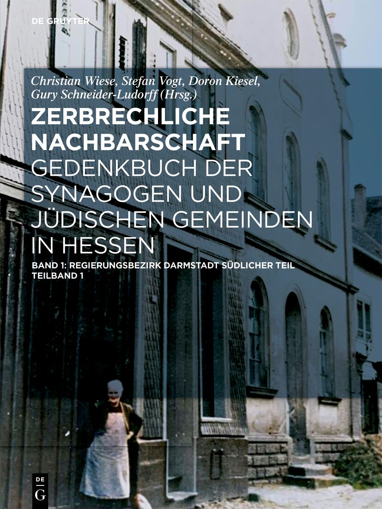

# Literatur

## Normalisierte Kurzangaben

| Kürzel |  | Bibliographische Information |  |
|---|---|---|---|
|  |  | Czech, Danuta (1989): Kalendarium der Ereignisse im Konzentrationslager Auschwitz-Birkenau 1939-1945. Hamburg. |  |
|  |  | Glazar, Richard (2002): Die Falle mit dem grünen Zaun. Frankfurt am Main. |  |
| MUHLZERB |  | [Fani Gargova](https://www.ieg-mainz.de/person/gargova/), [Tilmann Gempp-Friedrich](https://buber-rosenzweig-institut.de/personen/tilmann-gempp-friedrich/): Kapitel "Mühlheim" in: [Battenberg, Friedrich (Hrsg.): Zerbrechliche Nachbarschaft. Geschichte der Jüdinnen und Juden im heutigen Hessen. De Gruyter, November 2025](https://de.wikipedia.org/wiki/Spezial:ISBN-Suche?isbn=ISBN+978-3-11-143392-9+). | <ul><li><a href="https://uplopen.com/chapters/11699/files/0e2b5fdc-6c69-4b46-9b94-5e83e4d8fa7a.pdf">University Press Library Open (UPLOpen)</a></li><li><a href="https://uplopen.com/reader/chapters/pdf/10.1515/9783111465111-037">UPLOpen PDF Reader</a></li><li><a href="https://doi.org/10.1515/9783111465111-037">doi.org Reader</a></li></ul> |
|  |  | Gottwaldt, Alfred; Schulle, Diana: Die Judendeportationen aus dem Deutschen Reich 1941-1945. |  |
|  |  | Kurt, Alfred; Schlander, Otto (1991): Der Kreis Offenbach und das Dritte Reich. 1. Auflage. |  |
|  |  | Mirkes, Adolf; Schild, Karl; Schneider, Hans C. (1983): Mühlheim unter den Nazis 1933-1945. Ein Lesebuch. Frankfurt am Main. |  |
|  |  | Schneider, Hans C. (2000): Die Gemeinde braucht mich. Der letzte Vorsteher der jüdischen Gemeinde Mühlheims. |  |
|  |  | Stein, Harry (1992): Juden in Buchenwald 1937-1942. Gedenkstätte Buchenwald. |  |
|  |  | Steinweiss, Alan E. (2011): Kristallnacht 1938. Ein deutscher Pogrom. |  |
|  |  | Walk, J. (Hrsg.) (1996): Das Sonderecht für die Juden im NS-Staat. 2. Auflage. |  |
|  |  | Werner, Klaus: Die Verfolgung der Juden. In: Magistrat der Stadt Mühlheim am Main (Hrsg.): Mühlheim am Main 1933-1945. |  |

<!-- 

## Fußnoten extrahiert aus [judenverfolgung_muehlheim09-05-2020.pdf](../att/judenverfolgung_muehlheim09-05-2020.pdf)

### Seite 41

1 Im Stadtarchiv Mühlheim ist unter Signatur 061-05 ein „Namentliches Verzeichnis jüdischer Personen, die 1933 in Mühlheim am Main und Dietesheim ansässig waren" zu finden. Hiernach lebten 68 Juden in Mühlheim und 15 in Dietesheim Die von der Stadtverwaltung ge- machten Angaben stehen im Widerspruch zu den Angaben vom 16. Juni 1933. Dort werden 92 Juden in Mühlheim und Dietesheim genannt. Nachforschungen haben ergeben, dass die Angaben vom 16. Juni 1933 die realistischen sind, da einige Juden, die nachweislich noch nach 1933 in Mühlheim und Dietesheim wohnten, in der Auflistung der Stadt fehlen. Es ist wahrscheinlich, dass das Verzeichnis erst um 1938 ge- schrieben wurde.

2 Er und seine Frau können als die „Stammeltern“ für fast alle jüdischen Familien, die bis zur Zeit des Nationalsozialismus in Mühlheim am Main wohnten, angesehen werden. Bis zu diesem Zeitpunkt sind einzelne Juden in Mühlheim nachweisbar, aber eine zusammenhängende und kontinuierliche Entwicklung hin zu einer jüdischen Gemeinde beginnt mit dem Zuzug der Familie Rollmann.

3 Die Gebetsversammlungen finden im Haus von Gerson Strauß in der Pfarrgasse statt. Hier waren zwei Räume im 1. Stock für die Abhal- tung des Gottesdienstes hergerichtet.

4 Nachdem es zwischen der politischen und der jüdischen Gemeinde in Steinheim in den Jahren 1890/91 zu Spannungen wegen des alten Friedhofes kam, kaufte die jüdische Gemeinde Mühlheim am 24. Juni 1893 von Johann Kaspar Jung und dessen Ehefrau Josepha, geb. Kaiser, ein Grundstück außerhalb der damaligen Ortsbebauung, um einen eigenen Friedhof anzulegen. Der „Acker auf der Bruchwiese“, Flur II, Nr. 45, mit insgesamt 487 Quadratmetern wurde zum Preis von 70,- Mark erworben. Nicht das gesamte Grundstück ist als Friedhof genutzt worden, sondern nur der nördliche Teil wurde mit einer Mauer umfriedet. Die erste Beerdigung fand ein halbes Jahr später statt.

5 In seine Amtszeit fiel die schwere Aufgabe, Mühlheim durch den Wirrnisse des Ersten Weltkriegs und die anschließende Nachkriegszeit zu bringen.

6 Artikel im "Frankfurter Israelitischen Familienblatt vom 25. Oktober 1918

7 Artikel in der Zeitschrift "Der Israelit" vom 26. Februar 1920

8 In seine Amtszeit fielen die Inflation und die große Wirtschaftskriese. Mühlheim wurde elektrifiziert, eine eigene Pumpstation gebaut, das Straßen- und Kanalnetz erweitert, der Maindamm gebaut, die Rodau eingedämmt usw.

9 Artikel in der "Allgemeinen Zeitung des Judentums" vom 12. April 1922

10 Zur Behebung der Arbeitslosigkeit, die mit der um diese Zeit beginnenden Weltwirtschaftskriese einherging, wurden Notmaßnahmen durchgeführt. Eine mögliche Strecke für den Dammbau wurde schon 1907 vermessen, aber aufgrund Geldmangels und Weltkrieg zurückge- stellt. Viele damals arbeitslose Lederwarenarbeiter, auch Portefeuiller oder Babscher genannt, wurden beim Dammbau eingesetzt

11 Artikel in der Zeitschrift "Der Israelit" vom 24. Mai 1928

12 Artikel in der Zeitschrift "Der Israelit" vom 1. November 1928

13 Meta Stiefel war mit Max Stiefel verheiratet. Max Stiefel konnte mit seiner zweiten Frau Jenny am 15. Februar 1938 in die USA fliehen.

14 Artikel im "Frankfurter Israelitischen Familienblatt" vom 17. Juli 1930

15 Klaus Werner: Die Verfolgung der Juden. In: Magistrat der Stadt Mühlheim am Main (Hrsg.): Mühlheim am Main 1933 - 1945, Mühl- heim am Main, Seite 221; Chaim Tyson gehörte später der bedeutenden jüdischen Gemeinde in Offenbach an, wurde 1939 verhaftet und überlebte die Konzentrationslager Buchenwald und Auschwitz. Im Jahre 1945 gründete er die neue jüdische Gemeinde in Offenbach.

16 Artikel in der Zeitschrift "Der Israelit" vom 12. Februar 1931

17 Artikel in der Zeitschrift "Der Israelit" vom 30. April 1931

18 Artikel in der Zeitschrift "Der Israelit" vom 5. Januar 1933

19 Stadtarchiv Mühlheim, Signatur 123-03; Diese Pläne sind bei der Zerstörung des Landratsamtes im 2. Weltkrieg am 20. Dezember 1943 verbrannt. Es ist nicht mehr nachvollziehbar, welche Erweiterungen im Einzelnen vorgesehen waren. Wir können aber davon ausgehen, dass der südliche Teil des Friedhofsgrundstücks ebenfalls für Beerdigungen genutzt werden sollte. Das geplante Vorhaben wurde aber nicht ausgeführt. Nur 24 Tage nach Erteilung der Genehmigung kam es zur sogenannten „Machtergreifung“ durch die Nationalsozialisten.

20 Die Verordnung des Reichspräsidenten zum Schutze des Deutschen Volkes vom 4. Februar 1933 schränkte wenige Tage nach der Ernen- nung Adolf Hitlers zum deutschen Reichskanzler die Versammlungs- und Pressefreiheit weitgehend ein und erteilte dem der NSDAP ange- hörenden Reichsinnenminister Wilhelm Frick weitreichende Vollmachten.

21 Artikel in der Zeitschrift "Der Israelit" vom 23. Februar 1933

22 Deutsche Geschichte, erzählt von Manfred Mai, Weinheim Basel 2006, S. 128

23 Die Verordnung des Reichspräsidenten zum Schutz von Volk und Staat vom 28. Februar 1933 (RGBl. I S. 83), auch als Reichstagsbrand- verordnung bezeichnet, setzte die Bürgerrechte der Weimarer Verfassung außer Kraft und war neben der Verordnung des Reichspräsidenten zum Schutze des Deutschen Volkes vom 4. Februar 1933 und dem Ermächtigungsgesetz vom 24. März 1933 ein wichtiger Schritt zur Machtergreifung Adolf Hitlers und der Beseitigung des demokratischen Rechtsstaats. Für die Verkündigung wurde der Reichstagsbrand in der Nacht zuvor zum Anlass genommen.

24 Zum 1. Mai 1933 ordnete der Staatskommissar für das Polizeiwesen im Volksstaat Hessen, Werner Best, die Schaffung eines Konzentra- tionslagers für den Volksstaat in Osthofen bei Worms an. Dafür wurde eine stillgelegte Papierfabrik ausgewählt. Dort sollten all jene Ein- wohner Hessens interniert werden, die die Polizei aus politischen Gründen verhaftet und länger als eine Woche festgehalten hatte. Tatsäch- lich bestand dieses Konzentrationslager jedoch schon seit Anfang März 1933, und die ersten Häftlinge wurden ebenfalls vor der offiziellen Eröffnung eingeliefert. Bereits am 6. März kamen einzelne Häftlinge aus dem Ort Osthofen selbst im KZ an. Der erste größere Transport mit ungefähr 80 politischen „Schutzhäftlingen“ musste unter scharfer Bewachung den Fußweg von Worms nach Osthofen antreten. Ehrenamtli- cher Lagerleiter war der in Osthofen gebürtige SS-Sturmbannführer Karl d’Angelo. Bewacht wurde das Lager anfangs von zu Hilfspolizisten ernannten SS- und SA-Männern aus Worms und Umgebung. Im Herbst 1933 wurden die SA-Männer von SS-Männern aus Darmstadt und Offenbach abgelöst. Entnommen: Wikipedia „KZ Osthofen“

25 Mühlheimer Bote vom 16.03.1933, zitiert aus Adolf Mirkes, Karl Schild, Hans C. Schneider: Mühlheim unter den Nazis 1933 – 1945 – Ein Lesebuch, Frankfurt am Main 1983, S. 18

26 Die SPD stimmte als einzige Partei gegen das Ermächtigungsgesetz.

27 Idel Siwek wurde in Mühlheim von allen Julius genannt.

28 Adolf Mirkes, Karl Schild, Hans C. Schneider: Mühlheim unter den Nazis 1933 – 1945 – Ein Lesebuch, Frankfurt am Main 1983, S. 111

29 Das Ehestandsdarlehen war eine familien- und arbeitsmarktpolitische Maßnahme des Deutschen Reiches in der Zeit des Nationalsozia- lismus, bei der Jungvermählten ein Darlehen für die Beschaffung von Hausrat gewährt wurde. Damit waren mehrere Ziele verbunden. Durch gesteigerte Binnennachfrage wurde mittelbar die Arbeitsbeschaffung erhöht und zugleich der Arbeitsmarkt entlastet, weil die Ehefrau aus der Erwerbstätigkeit ausscheiden musste. Außerdem sollte als bevölkerungspolitische Maßnahme die Geburtenrate gesteigert werden.

30 Der Familienname „Friz“ oder „Fritz“ existiert in verschiedenen Schreibweisen. Der Autor benutzt die Schreibweise „Friz“. In Zitaten aus anderen Quellen können hiervon Abweichungen entstehen.

31 Als Röhm-Putsch werden Ereignisse Ende Juni/Anfang Juli 1934 bezeichnet, bei denen die Nationalsozialisten die Führungsebene der SA einschließlich Stabschef Ernst Röhm ermordeten. Die nationalsozialistische Propaganda stellte die Morde als präventive Maßnahme gegen einen angeblich bevorstehenden Putsch der SA unter Röhm – den sogenannten Röhm-Putsch – dar. In der Folge wurde der Begriff Röhm- Putsch nicht mehr nur für den angeblichen Putsch, sondern für die gesamten Ereignisse einschließlich der Morde benutzt. In der Nacht der langen Messer (30. Juni/1. Juli 1934) wurden Ernst Röhm und weitere auf Hitlers Anweisung am Tegernsee zusammengeru- fene Funktionäre der SA-Führung verhaftet und – zum Teil noch in derselben Nacht – ermordet. Weitere Ermordungen folgten in den nächs- ten Tagen. Es sind namentlich etwa 90 Ermordete nachzuweisen, einige Forscher gehen aber weiterhin von einer Gesamtzahl von etwa 150–

### Seite 42

32 „Und keiner hat für uns Kaddisch gesagt…“ – Deportationen aus Frankfurt am Main 1941 bis 1945, Begleitpublikation zur gleichnamigen Ausstellung des Jüdischen Museums der Stadt Frankfurt am Main, Stroemfeld Verlag 2004, Seite 54

33 Das Gesetz gegen heimtückische Angriffe auf Staat und Partei und zum Schutz der Parteiuniformen vom 20. Dezember 1934, bekannt unter dem Begriff Heimtückegesetz, stellte die missbräuchliche Benutzung von Abzeichen und Parteiuniformen unter Strafe. Es schränkte darüber hinaus das Recht auf freie Meinungsäußerung ein und kriminalisierte alle kritischen Äußerungen, die angeblich das Wohl des Rei- ches, das Ansehen der Reichsregierung oder der NSDAP schwer schädigten. (Quelle: Wikipedia 2016) Allein in München erhoben Staats- anwälte zwischen November 1938 und März 1939 Anklage in 32 Fällen, die mit dem Pogrom und seinen Nachwehen in Verbindung standen.

34 Klaus Werner: Die Verfolgung der Juden. In: Magistrat der Stadt Mühlheim am Main (Hrsg.): Mühlheim am Main 1933 - 1945, Mühl- heim am Main, Seite 205f.

35 Entnommen aus: Klaus Werner: Die Verfolgung der Juden. In: Magistrat der Stadt Mühlheim am Main (Hrsg.): Mühlheim am Main 1933 - 1945, Mühlheim am Main, Seite 194

36 Alfred Kurt und Otto Schlander, Der Kreis Offenbach und das Dritt Reich, 1. Auflage 1991, Seite 212 f.

37 Hessisches Hauptstaatsarchiv Wiesbaden Signatur 483/2815

38 David Frankfurter (* 9. Juli 1909 in Daruvar, Österreich-Ungarn; † 19. Juli 1982 in Tel Aviv) war ein israelischer Offizier, der als junger Mann Anfang der 1930er Jahre aus seinem damals zu Jugoslawien gehörenden Heimatort zu Verwandten nach Frankfurt am Main gekom- men war, um in Deutschland Medizin zu studieren. Er erlebte dort die mit der Machtergreifung der Nationalsozialisten einsetzende massive Drangsalierung der jüdischen Bevölkerungsgruppe. Ende 1933 emigrierte er in die Schweiz. 1936 beging er dort ein tödliches Attentat auf den Leiter der nationalsozialistischen Partei der Schweiz Wilhelm Gustloff. Er wollte damit zeigen, dass Juden sich gegen das nationalsozia- listische „Unrechtsregime auflehnten“. Die Schweiz führte einen Strafprozess gegen David Frankfurter. Die Regierung bemühte sich in dem Gerichtsverfahren um die Wahrung von Rechtsstaatlichkeit und diplomatischer Neutralität. Schließlich wurde der voll geständige und jeder- zeit kooperative David Frankfurter für den unstrittigen Mord unter großem internationalem Interesse am 14. Dezember 1936 in Chur zu achtzehn Jahren Haft und anschließender lebenslänglicher Landesverweisung verurteilt. Ab 1943 wurde Frankfurter vom Berner Anwalt Georges Brunschvig betreut, der maßgeblich an seiner Begnadigung beteiligt war: Nach Kriegsende wurde Frankfurter am 1. Juni 1945 freigelassen und aus der Schweiz ausgewiesen. Frankfurter wanderte ins britische Mandatsgebiet Palästina nach Tel Aviv aus. In Israel wurde er Beamter im Verteidigungsministerium und später Offizier der israelischen Verteidigungskräfte. Erst nach dem Krieg erfuhr Frank- furter, dass sein Vater nach der deutschen Besetzung Jugoslawiens 1941 in seinem Wohnort von der Gestapo gezielt verhaftet, gefoltert und ermordet worden war. 1969 nahm der Große Rat des Kantons Graubünden die Landesverweisung zurück. Quelle: Wikipedia 2016

39 Alfred Kurt und Otto Schlander, Der Kreis Offenbach und das Dritt Reich, 1. Auflage 1991, Seite 216

40 Artikel in der Zeitschrift "Der Israelit". vom 15. Juli 1937

41 Die Hoßbach-Niederschrift, oft auch als Hoßbach-Protokoll bezeichnet, ist eine von Oberst Friedrich Hoßbach ohne Auftrag und nach schlagwortartigen Notizen angefertigte Niederschrift über eine Besprechung am 5. November 1937 in Berlin, während deren Adolf Hitler in einem mehrstündigen Monolog den wichtigsten Vertretern der Wehrmacht und dem Außenminister von Neurath die Grundzüge seiner auf gewaltsame Expansion ausgerichteten Außenpolitik darstellte. Die Hoßbach-Niederschrift ist eine zentrale Quelle für die Vorgeschichte des Zweiten Weltkriegs und diente der Anklagevertretung in den Nürnberger Prozessen als Beweismittel dafür, dass die Angeklagten einen Angriffskrieg vorbereiteten.

42 Hans Josef Maria Globke (* 10. September 1898 in Düsseldorf; † 13. Februar 1973 in Bonn) war Verwaltungsjurist im preußischen und im Reichsinnenministerium sowie Mitverfasser und Kommentator der Nürnberger Rassegesetze in der Zeit des Nationalsozialismus und von

43 Arthur Seyß-Inquart war ein österreichischer Jurist, der in der Zeit des Nationalsozialismus in unterschiedlichen Funktionen politisch Karriere machte. Er gehörte zu den 24 im Nürnberger Prozess gegen die Hauptkriegsverbrecher vor dem Internationalen Militärgerichtshof angeklagten Personen, wurde am 1. Oktober 1946 in drei von vier Punkten schuldig gesprochen und als Kriegsverbrecher hingerichtet.

44 J: Walk (Hrsg.), Das Sonderecht für die Juden im NS-Staat, 2. Auflage 1996

45 Alan E. Steinweiss, Kristallnacht 1938 – Ein deutscher Pogrom, 2011, S. 21. Zum ersten Mal trieb das NS-Regime eine größere Menge Juden zusammen und sperrte sie in Lagern ein. Die meisten jüdischen Gefangenen waren noch im November dort, als eine weitaus größere Zahl von Juden zu ihnen stieß, die während und direkt nach dem Pogrom verhaftet wurden.

46 Ernst Kaltenbrunner war ein österreichischer Nationalsozialist, sowohl in Österreich und später im nationalsozialistischen Deutschen Reich ein hochrangiger SS-Funktionär und von 1943 bis Kriegsende Chef der Sicherheitspolizei und des SD sowie Leiter des Reichssicher- heitshauptamtes (RSHA). Kaltenbrunner gehörte zu den 24 im Nürnberger Prozess gegen die Hauptkriegsverbrecher vor dem Internationalen Militärgerichtshof angeklagten Personen, wurde am 1.Oktober 1946 in zwei von drei Anklagepunkten schuldig gesprochen, zum Tod durch den Strang verurteilt und am 16. Oktober 1946 hingerichtet.

47 Motivation für die Tat war die Deportation von etwa 12.000 bis 17.000 in Deutschland lebenden polnischen Juden im Oktober 1938. Unter diesen Abgeschobenen waren auch Sendel und Rifka Grynszpan und zwei Geschwister von Herschel.

48 Nachdem der Führer der SA-Brigade 50 in Darmstadt, Karl Lucke, bereits am Vormittag des 10. November telefonisch der SA- Gruppenführung in Mannheim den Vollzug des Befehls zur Zerstörung der Synagogen in Starkenburg gemeldet hatte, berichtet er ausführli- cher über das Ergebnis der Aktion: Er habe nach Eingang des Befehls des Gruppenführers am 10. November um 3.00 Uhr sofort die Standar- tenführer alarmiert, sie genauestens instruiert und mit dem Vollzug begonnen. Er gibt in seinem Bericht eine Aufstellung über die Synago- gen, die von den fünf beteiligten SA-Standarten 115 (Darmstadt), 145 (Bergstraße), 168 (Offenbach), 186 (Odenwald und Dieburg) und 221 (Groß-Gerau). Insgesamt wurden bei der Aktion 35 Synagogen durch Brand zerstört, abgebrochen oder mit ihrer Inneneinrichtung verwüstet. Der Bericht wurde als Dokument PS-1721 als Beweismittel der Anklage im Nürnberger Militärtribunal gegen die Hauptkriegsverbrecher verwendet und ist in den Unterlagen des Nürnberger Prozesses dokumentiert. Der SA-Brigadeführer Karl Lucke (geb. 1889), war seit April

49 Helmuth Schranz (* 7. Januar 1897 in Haiger; † 7. Mai 1968 in Offenbach am Main) war ein deutscher Politiker (DP, später GDP). Helmuth Schranz war promovierter Jurist und Versicherungskaufmann. Seit 1925 war er Mitglied der NSDAP und von 1934 bis 1945 Ober- bürgermeister und NSDAP-Kreisleiter von Offenbach. Schranz gehörte dem Deutschen Bundestag von 1953 bis 1961 an. Von 1957 bis zum 9. November 1960 war er stv. Vorsitzender des Bundestagsausschusses für Kommunalpolitik und öffentliche Fürsorge. Ursprünglich für die Deutsche Partei gewählt, wurde er nach der Fusion mit dem GB/BHE am 3. Mai 1961 Mitglied der neuen GDP, die er mit Herbert Schneider

### Seite 43

50 Alfred Kurt und Otto Schlander, Der Kreis Offenbach und das Dritt Reich, 1. Auflage 1991, Seite 222

51 Nachkriegsaussage von Anton Winter, entnommen aus: Klaus Werner: Die Verfolgung der Juden. In: Magistrat der Stadt Mühlheim am Main (Hrsg.): Mühlheim am Main 1933 - 1945, Mühlheim am Main, Seite 194

52 Gesprächsnotiz von Hans C. Schneider mit August Zöller am 23. + 24. Juli 1979

53 Hans C. Schneider, Die Gemeinde braucht mich – Der letzte Vorsteher der jüdischen Gemeinde Mühlheims, April 2000, Seite 39

54 Protokoll von Otto Wolff zur Anhörung zum Synagogenbrand vom 12.11.1947, Stadtarchiv 061-05

55 Alan E. Steinweiss, Kristallnacht 1938 – Ein deutscher Pogrom, 2011, S. 92

56 Hans C. Schneider, In jenem Frühjahr, 1989, Seite 28

57 Vergleiche hierzu Hans C. Schneider, Die Gemeinde braucht mich – Der letzte Vorsteher der jüdischen Gemeinde Mühlheims, April 2000, Seite 40

58 Hans C. Schneider, Die Gemeinde braucht mich – Der letzte Vorsteher der jüdischen Gemeinde Mühlheims, April 2000, Seite 41

59 Klaus Werner: Die Verfolgung der Juden. In: Magistrat der Stadt Mühlheim am Main (Hrsg.): Mühlheim am Main 1933 - 1945, Mühlheim am Main, Seite 206

60 Entnommen aus: Klaus Werner: Die Verfolgung der Juden. In: Magistrat der Stadt Mühlheim am Main (Hrsg.): Mühlheim am Main 1933 - 1945, Mühlheim am Main, Seite 194 f.

61 Hans C. Schneider, Die Gemeinde braucht mich – Der letzte Vorsteher der jüdischen Gemeinde Mühlheims, April 2000, Seite 41f.

62 Vergleiche hierzu Hans C. Schneider, Die Gemeinde braucht mich – Der letzte Vorsteher der jüdischen Gemeinde Mühlheims, April 2000, Seite 39ff.

63 Alle nach dem Novemberpogrom eingelieferten Juden erhalten eine Nummer ab 20.000 aufwärts. Die sechsstellige Nummer von Julius Siwek stammt von seiner späteren, zweiten Einlieferung ins KZ Buchenwald. Thüringisches Hauptstaatsarchiv Weimar, Konzentrationslager Buchenwald, Geldkarte Siwek, Idel (Häftlingsnummer 25834)

64 Schreiben der Stadt Mühlheim am Main an den Regierungspräsidenten Darmstadt vom 19.06.1952, Stadtarchiv Mühlheim am Main, Signatur 061-05

65 Alan E. Steinweiss, Kristallnacht 1938 – Ein deutscher Pogrom, 2011, S. 58f.

66 Thüringisches Hauptstaatsarchiv Weimar, Konzentrationslager Buchenwald, Geldkarte Fric, Paul (Häftlingsnummer [?]), Paul Friz wird in den Geldkarten des KZ Buchenwald unter dem Namen „Fric“ geführt. Eine Häftlingsnummer ist dort nicht vermerkt.

67 Thüringisches Hauptstaatsarchiv Weimar, Konzentrationslager Buchenwald, Geldkarte Stern, Hermann (Häftlingsnummer 25831)

68 Thüringisches Hauptstaatsarchiv Weimar, Konzentrationslager Buchenwald, Geldkarte Wolf, Josef (Häftlingsnummer 25840); Anmerkung: Der Name von Josef Wolf wird im obigen Text immer mit „Joseph“ geschrieben, entsprechend des Geburtseintrags in den Registern der Stadt Mühlheim am Main.

69 Heinrich Müller („Gestapo-Müller“; * 28. April 1900 in München; † wohl im Mai 1945; zum 1. Mai 1945 für tot erklärt) war ein Mitarbeiter der Geheimen Staatspolizei (Gestapo, Amt IV im Reichssicherheitshauptamt (RSHA)) und ab Oktober 1939 Leiter dieser Behörde. Quelle: Wikipedia 2016

70 J: Walk (Hrsg.), Das Sonderecht für die Juden im NS-Staat, 2. Auflage 1996

71 Gesprächsnotiz von Hans C. Schneider mit Julius Siwek vom 11.03.1979

72 Hans C. Schneider beschreibt in seinen Büchern, dass die Mühlheimer Juden „mit dem bekannten „Silbervogel“-Bus“ ins KZ Buchenwald gebracht wurden. Er bezieht sich auf eine Gesprächsnotiz mit Gurdina Siwek vom 17.01.1979. Hier stehen die Aussagen von Alfred Gottwaldt und Diana Schulle: Die „Judendeportationen“ aus dem Deutschen Reich 1941 – 1945, Seite 28ff. entgegen, die beschreiben, dass die sogenannten „Aktions-Juden“ mit Sonderzügen nach Buchenwald oder Dachau gebracht wurden. Nur die Verschleppten aus dem Nordosten Deutschlands wurden auch mit LKWs, Gefangenentransportwagen und Omnibussen ins KZ Sachsenhausen gebracht.

73 Dieses und die nachfolgenden Zitate zur Situation nach der Pogromnacht im KZ Buchenwald stammen aus: Harry Stein, Juden in Buchenwald 1937 – 1942, Gedenkstätte Buchenwald 1992

74 Dr. Joachim Mrugowsky (* 15. August 1905 in Rathenow an der Havel; † 2. Juni 1948 in Landsberg am Lech) war ein deutscher SS-Oberführer und Leiter des Hygiene-Instituts der Waffen-SS. Mrugowsky wurde im Nürnberger Ärzteprozess angeklagt, wegen verbrecherischer Menschenversuche zum Tode durch Hängen verurteilt und 1948 im damaligen Kriegsverbrechergefängnis Landsberg (War Criminals Prison No. 1) hingerichtet. Quelle: Wikipedia

75 Karl Otto Koch (* 2. August 1897 in Darmstadt; † 5. April 1945 im KZ Buchenwald) war ein deutscher SS-Führer und Lagerkommandant mehrerer Konzentrationslager. Koch war von Juli 1937 bis Dezember 1941 Kommandant des KZ Buchenwald. Kurz vor Kriegsende wurde Karl Otto Koch durch ein Erschießungskommando der SS am 5. April 1945 im KZ Buchenwald hingerichtet, eine Woche vor der Befreiung des Lagers.

76 Hans C. Schneider, Die Gemeinde braucht mich – Der letzte Vorsteher der jüdischen Gemeinde Mühlheims, April 2000, Seite 43. Außerdem erhielt Julius Siwek während seiner Leidenszeit in den KZs eine Verwundung am Bein.

77 „(§ 1) Juden (§ 5 der ersten Verordnung zum Reichsbürgergesetz vom 14. November 1935, Reichsgesetzbl. I S 1333) ist der Erwerb, der Besitz und das Führen von Schusswaffen und Munition sowie von Hieb- oder Stoßwaffen verboten. Sie haben die in ihrem Besitz befindlichen Waffen und Munition unverzüglich der Ortspolizeibehörde abzuliefern. (§ 2) Waffen und Munition, die sich im Besitz eines Juden befinden, sind dem Reich entschädigungslos verfallen.“

78 Mit der „Verordnung zur Ausschaltung der Juden aus dem deutschen Wirtschaftsleben“ (RGBl. 1938 I, S. 1580) vom 12. November 1938 wurde Juden der Betrieb von Einzelhandelsverkaufsstellen sowie die selbständige Führung eines Handwerksbetriebs mit Wirkung zum Jahresende 1938 untersagt. Auch durften Juden nicht mehr als Betriebsführer tätig sein und konnten als leitende Angestellte ohne Abfindung entlassen werden. Wikipedia 2016

79 Alan E. Steinweiss, Kristallnacht 1938 – Ein deutscher Pogrom, 2011, S. 108

80 Bernhard Rust (* 30. September 1883 in Hannover; † 8. Mai 1945 in der Gemeinde Berend/Nübel, Kreis Schleswig) war ein deutscher Politiker (NSDAP. 1933/34 leitete er das preußische Kultusministerium und von 1934 bis 1945 das Reichsministerium für Wissenschaft, Erziehung und Volksbildung. Rust war ein Hauptvertreter der nationalsozialistischen Erziehung.

81 In der Verordnung über den Einsatz des jüdischen Vermögens (RGBl. 1938 I. S. 1709) vom 3. Dezember 1938) wurde Juden auferlegt, ihre Gewerbebetriebe zu verkaufen oder abzuwickeln, ihren Grundbesitz zu veräußern und ihre Wertpapiere bei einer Devisenbank zu hinterlegen. Außerdem durften sie Juwelen, Edelmetalle und Kunstgegenstände nicht mehr frei veräußern; kurz darauf wurde ihnen unter Strafandrohung auferlegt, diese bis zum 31. März 1939 bei staatlichen Ankaufstellen abzuliefern. Wikipedia 2016

82 Er wird freigesprochen, da es sich nur um eine kurze Unterhaltung gehandelt habe, ein Tag bevor Arnold Rollmann nach England „auswanderte“.

83 Als Kindertransport (auch Refugee Children Movement) wird international die Ausreise von über 10.000 Kindern, die als „jüdisch“ im Sinne der Nürnberger Gesetze galten, aus dem Deutschen Reich und aus von diesem bedrohten Ländern zwischen Ende November 1938 und dem 1. September 1939 nach Großbritannien bezeichnet. Auf diesem Wege gelangten vor allem Kinder aus Deutschland, Österreich, Polen, der Freien Stadt Danzig und der Tschechoslowakei ins Exil. In Zügen und mit Schiffen konnten die Kinder ausreisen; die meisten sahen ihre Eltern nie wieder. Oftmals waren sie die einzigen aus ihren Familien, die den Holocaust überlebten. (Quelle: Wikipedia) der Freien Stadt Danzig und der Tschechoslowakei ins Exil. In Zügen und mit Schiffen konnten die Kinder ausreisen; die meisten sahen ihre Eltern nie wieder. Oftmals waren sie die einzigen aus ihren Familien, die den Holocaust überlebten. (Quelle: Wikipedia)

### Seite 44

84 Schreiben der Stadt Mühlheim am Main an den Landrat des Kreises Offenbach vom 28.04.1939 (Stadtarchiv 061-05) sowie Hans C. Schneider, Die Gemeinde braucht mich – Der letzte Vorsteher der jüdischen Gemeinde Mühlheims, April 2000, Seite 101. Die Angaben aus dem Buch von Hans C. Schneider stehen im Widerspruch zur Angabe des 13.02.1939, die ebenfalls von Hans C. Schneider stammt. Es ist unwahrscheinlich, dass Leopold Isaak einerseits im KZ Buchenwald eingesperrt und andererseits am Verkauf der Synagoge beteiligt war.

85 Julius Heinrich Dorpmüller (* 24. Juli 1869 in Elberfeld; † 5. Juli 1945 in Malente-Gremsmühlen) war ein deutscher Eisenbahningenieur und Politiker. Von 1926 bis zu seinem Tod war er Generaldirektor der Deutschen Reichsbahn, ab 1937 zusätzlich Reichsverkehrsminister sowie kurzzeitig im Mai 1945 Reichspostminister. Während des Zweiten Weltkriegs blieb Dorpmüller oberster Reichsbahner, trotz verschie- dener Versuche, vor allem von Albert Speer, ihn abzulösen. Unter seiner Führung erreichte die Reichsbahn die größten Beförderungs- und Transportleistungen ihrer Geschichte. Zugleich sicherte sie unter Dorpmüller auch den Nachschub der Wehrmacht an allen Fronten des Krieges und war am Transport der Opfer des Holocaust in die Vernichtungslager beteiligt. Die westlichen Alliierten sahen den Reichsver- kehrsminister eingedenk seines guten Rufs aus Vorkriegszeiten zunächst für die Leitung des Wiederaufbaus der Reichsbahn vor. Der bereits schwer kranke Dorpmüller starb aber kurz nach Kriegsende.

86 Hans C. Schneider, In jenem Frühjahr, 1989, Seite 20

87 Hans C. Schneider, In jenem Frühjahr, 1989, Seite 19

88 „Und keiner hat für uns Kaddisch gesagt…“ – Deportationen aus Frankfurt am Main 1941 bis 1945, Begleitpublikation zur gleichnamigen Ausstellung des Jüdischen Museums der Stadt Frankfurt am Main, Stroemfeld Verlag 2004, Seite 24f.

89 „Und keiner hat für uns Kaddisch gesagt…“ – Deportationen aus Frankfurt am Main 1941 bis 1945, Begleitpublikation zur gleichnamigen Ausstellung des Jüdischen Museums der Stadt Frankfurt am Main, Stroemfeld Verlag 2004, Seite 25

90 J: Walk (Hrsg.), Das Sonderecht für die Juden im NS-Staat, 2. Auflage 1996; Im angegebenen Buch wurde fälschlicherweise der 26.10.1936 als Datum für den Runderlass genannt – das daneben stehende Aktenzeichen verweist jedoch eindeutig auf das Jahr 1939.

91 Wolf Wladislaw Siwek war vom 01.01.1940 bis zum 01.05.1945 verhaftet. Sein Leidensweg führte ihn durch die KZs Dachau, Auschwitz I und II, Großrosen und wieder Dachau. Während dieser Zeit erhielt er mindestens eine große Verletzung auf dem Rücken.

92 Friedrich Uebelhoer (* 25. September 1893 in Rothenburg ob der Tauber; † um 1945) war ein deutscher Politiker (NSDAP).

93 Johannes Schäfer (* 14. Dezember 1903 in Leipzig; † 28. April 1993 in Bielefeld) war ein deutscher Politiker (NSDAP), SS-Führer, sowie nach dem Zweiten Weltkrieg zeitweise BND-Mitarbeiter.

94 Rudolf Franz Ferdinand Höß (* 25. November 1901 in Baden-Baden; † 16. April 1947 in Auschwitz) war ein deutscher Nationalsozialist, SS-Obersturmbannführer und von Mai 1940 bis November 1943 Kommandant des Konzentrationslagers Auschwitz. Er wurde als Kriegsver- brecher 1947 zum Tode durch den Strang verurteilt und am Ort des ehemaligen Stammlagers hingerichtet.

95 Gerhard Arno Max Palitzsch (* 17. Juni 1913 in Großopitz; † 7. Dezember 1944 bei Budapest) war ein deutscher SS-Hauptscharführer, der als Rapport- und Lagerführer im KZ Auschwitz eingesetzt war.

96 Berta Stiefel war die zweite Frau von David Stiefel und seit dem 25.05.1885 mit ihm verheiratet. Siehe auch „29. Juni 1931“

97 Thüringisches Hauptstaatsarchiv Weimar, Konzentrationslager Buchenwald, Geldkarte Fric, Paul (Häftlingsnummer [?])

98 Otto Gustav Wächter (* 8. Juli 1901 in Wien; † 14. Juli 1949 in Rom, 1918/1919 Freiherr von Wächter) war ein österreichischer Jurist, nationalsozialistischer Politiker und SS-Führer, zuletzt im Rang eines SS-Gruppenführers und Generalleutnants der Polizei.

99 schriftliche Bestätigung des Sonderstandesamtes Arolsen vom 26.07.1996

100 Unterlagen des Internationalen Suchdienstes in Bad Arolsen, Schreiben vom 15.09.2000

101 Und keiner hat für uns Kaddisch gesagt…“ – Deportationen aus Frankfurt am Main 1941 bis 1945, Begleitpublikation zur gleichnami- gen Ausstellung des Jüdischen Museums der Stadt Frankfurt am Main, Stroemfeld Verlag 2004, Seite 184

102„Und keiner hat für uns Kaddisch gesagt…“ – Deportationen aus Frankfurt am Main 1941 bis 1945, Begleitpublikation zur gleichnami- gen Ausstellung des Jüdischen Museums der Stadt Frankfurt am Main, Stroemfeld Verlag 2004, Seite 116

103 Alfred Gottwaldt, Diana Schulle: Die „Judendeportationen“ aus dem Deutschen Reich 1941 – 1945, Seite 72f.

104 Akten für Todeserklärungen des Nachlassgerichts Frankfurt am Main, 51 II UR 213/61

105 Datenbank Gedenkstätte Neuer Börneplatz in Frankfurt am Main; Als offizieller Todestag wurde der 31.12.1945 vom Amtsgerichts Frankfurt festgelegt.

106 Datenbank Gedenkstätte Neuer Börneplatz in Frankfurt am Main

107 Alfred Gottwaldt, Diana Schulle: Die „Judendeportationen“ aus dem Deutschen Reich 1941 – 1945, Seite 22

108 Karl Jäger (* 20. September 1888 in Schaffhausen, Schweiz; † 22. Juni 1959 im Gefängnis Hohenasperg) war ein deutscher SS- Funktionär in der Zeit des Nationalsozialismus und ein Täter des Holocaust. Er war seit 1940 SS-Standartenführer, Leiter des SD-Abschnitts Münster, Führer des Einsatzkommandos 3 in Litauen und Polizeipräsident von Reichenberg/Sudetenland. Quelle: Wikipedia

109 Aktion Reinhardt (auch als Einsatz Reinhardt bezeichnet; daneben finden sich die Schreibweisen Reinhard bzw. Reinhart) ist ein Tarn- name für die systematische Ermordung aller Juden und Roma des Generalgouvernements (deutsch besetztes Polen und Ukraine) in der Zeit des Nationalsozialismus. Im Zuge der „Aktion Reinhardt“ wurden zwischen Juli 1942 und Oktober 1943 über zwei Millionen Juden sowie rund 50.000 Roma aus den fünf Distrikten des Generalgouvernements (Warschau, Lublin, Radom, Krakau und Galizien) in den drei Vernich- tungslagern Bełżec, Sobibór und Treblinka ermordet.

110 Odilo Lothar Ludwig Globocnik, eingedeutscht Globotschnig(g).(slowen. Globočnik)' Spitzname Globus (* 21. April 1904 in Triest; † 31. Mai 1945 in Paternion, Kärnten) war ein österreichischer Kriegsverbrecher, Nationalsozialist, SS-Gruppenführer und Generalleutnant der Polizei. Nach dem Anschluss Österreichs an das Deutsche Reich wurde er für einige Monate Gauleiter in Wien und war dort maßgeblich für die Judenverfolgung verantwortlich. Nach der deutschen Besetzung Polens wurde er SS- und Polizeiführer im Distrikt Lublin des General- gouvernements. Als Leiter der Aktion Reinhardt zur Vernichtung der Juden im Generalgouvernement unterstanden ihm die Vernichtungsla- ger Bełżec, Sobibor und Treblinka. In seiner Eigenschaft als Geschäftsführer der Ostindustrie GmbH organisierte er die Ausbeutung jüdi- scher Arbeitskräfte mit. 1943 wurde er zum Höheren SS- und Polizeiführer in der Operationszone Adriatisches Küstenland ernannt, wo er die Bekämpfung von Partisanen und die Deportation von Juden in das KZ Auschwitz-Birkenau organisierte. Nach Kriegsende wurde er Ende Mai 1945 durch Angehörige der britischen Armee festgenommen und beging kurz darauf Suizid.

111 Im Jahr 1954 kam Mordechai Chmielnicki nach Mühlheim zurück und bekam alle aufbewahrten Wäsche- und Schmuckstücke (die eine andere Mühlheimerin verwahrt hatte) zurück. Die noch im Besitz von Dora Chmielnicki befindlichen Möbel und Wäsche wurden nach deren Abtransport am 17.09.1942 vom Finanzamt Offenbach am Main – Abwicklungsstelle – in Verwahrung genommen und später versteigert.

112 Alfred Gottwaldt, Diana Schulle: Die „Judendeportationen“ aus dem Deutschen Reich 1941 – 1945, Seite 186

113 Izbica, ein winziger Flecken an der unbedeutenden Landstraße 121, 30 Kilometer südlich von Lublin, in Ostpolen. Wichtig wird Izbica als im Juli 1942 die sogenannte „Aktion Reinhardt“ beginnt, Kennwort für die geplante Ermordung von über 2.000.000 Juden sowie rund 50.000 Roma in Polen; ein Spezialauftrag von Heinrich Himmler persönlich. Bei Beginn der „Aktion Reinhardt“ wurden Orte für Durch- gangsghettos festgelegt. Izbica lag strategisch günstig zwischen den Vernichtungslagern Bełżec und Sobibór im Süden, Majdanek und Treb- linka im Norden, die an der Bahnlinie aufgereiht sind. Izbica diente nach Beginn der „Aktion Reinhard“ somit als Zwischenstation für die deportierten Juden in die Vernichtungslager.

114 Rolf Günther (* 8. Januar 1913 in Erfurt; † August 1945 in Ebensee) war ein deutscher SS-Sturmbannführer und ab 1941 Stellvertreter Adolf Eichmanns in der Abteilung IV B 4 („Auswanderung und Judenangelegenheiten“) im Reichssicherheitshauptamt (RSHA).

### Seite 45

115 Diese Angabe in vielen Melderegistern ist u.a. der Grund, warum viele historische Arbeiten das Leben deutscher Juden im Jahr 1942 in «Trawniki» enden lassen. Gleichwohl war «Trawniki» für den SS-Apparat kein beliebiger Name, denn dort unterhielt der SS- und Polizeiführer im Distrikt Lublin unter dem Kommando des SS-Obersturmführers Karl Streibel ein Lager zur Ausbildung von ehemaligen russischen Kriegsgefangenen zu Hilfswilligen für die SS.

116 Alfred Gottwaldt, Diana Schulle: Die „Judendeportationen“ aus dem Deutschen Reich 1941 – 1945, Seite 186f.

117 schriftliche Bestätigung des Sonderstandesamtes Arolsen vom 26.07.1996

118 Abmelderegister der Stadt Mühlheim am Main 1939

119 „Und keiner hat für uns Kaddisch gesagt…“ – Deportationen aus Frankfurt am Main 1941 bis 1945, Begleitpublikation zur gleichnamigen Ausstellung des Jüdischen Museums der Stadt Frankfurt am Main, Stroemfeld Verlag 2004, Seite 35

120 Akten für Todeserklärungen des Amtsgerichts Offenbach am Main, 4 II 311-312/55

121 Suchmaschine der Zentrale Datenbank der Namen der Holocaustopfer der Gedenkstätte Yad Vashem

122 Ludmila Chládková: Ghetto Theresienstadt, 2. Auflage, Praha 1995

123 Thersenstädter Gedenkbuch – Die Opfer der Judentransporte aus Deutschland nach Theresienstadt 1942 bis 1945, Institut Theresienstädter Initiative, Praha 2000

124 Alfred Gottwaldt, Diana Schulle: Die „Judendeportationen“ aus dem Deutschen Reich 1941 – 1945, Seite 431.

125 Thersenstädter Gedenkbuch – Die Opfer der Judentransporte aus Deutschland nach Theresienstadt 1942 bis 1945, Institut Theresienstädter Initiative, Praha 2000

126 Thersenstädter Gedenkbuch – Die Opfer der Judentransporte aus Deutschland nach Theresienstadt 1942 bis 1945, Institut Theresienstädter Initiative, Praha 2000

127 Danuta Czech, Kalendarium der Ereignisse im Konzentrationslager Auschwitz-Birkenau 1939 – 1945, Hamburg 1989, S. 388

128 Das Sterbedatum von Sally Stiefel wurde der Datenbank Gedenkstätte Neuer Börneplatz entnommen

129 Abmelderegister der Stadt Mühlheim am Main 1939

130 Adolf Mirkes, Karl Schild, Hans C. Schneider: Mühlheim unter den Nazis 1933 – 1945 – Ein Lesebuch, Frankfurt am Main 1983, S. 116

131 Alfred Gottwaldt, Diana Schulle: Die „Judendeportationen“ aus dem Deutschen Reich 1941 – 1945, Seite 430f.

132 Bezeichnung des tschechischen Wohlfahrtsministerium in Prag, Akten des Nachlassgerichts Frankfurt am Main, 51 II UR 177/50

133 Familienlager für Juden aus Theresienstadt

134 Danuta Czech, Kalendarium der Ereignisse im Konzentrationslager Auschwitz-Birkenau 1939 – 1945, Hamburg 1989, S. 776

135 Auschwitz – Geschichte und Wirklichkeit des Vernichtungslagers, Hamburg 1980, S. 31

136 Danuta Czech, Kalendarium der Ereignisse im Konzentrationslager Auschwitz-Birkenau 1939 – 1945, Hamburg 1989, S. 776

137 Klaus Werner: Die Verfolgung der Juden. In: Magistrat der Stadt Mühlheim am Main (Hrsg.): Mühlheim am Main 1933 – 1945, Mühlheim am Main 1994, Seite 201

138 In früheren Berichten, auch des Autors, war zu lesen: „Sammelpunkt hier war die zum jüdischen Altersheim für ganz Südhessen umfunktionierte Privatklinik von Dr. Max Rosenthal in der Eschollbrücker Straße“. Die Angaben sind aus Eva Reinhold-Postina, Moritz Neumann, Das Darmstädter Synagogenbuch, Darmstadt 1988, entnommen. Diese Angaben im Zusammenhang mit der Verschleppung der Mühlheimer Juden zu machen war falsch, da die Privatklinik von der jüdischen Gemeinde Darmstadt in Zusammenhang mit der Auswanderung/Flucht von Darmstädter Juden genutzt wurde. Die jetzigen Angaben stammen aus „Darmstadt als Deportationsort“, Initiative „Gedenkort Güterbahnhof Darmstadt“, April 2004, S. 17

139 Hans C. Schneider, Die Gemeinde braucht mich – Der letzte Vorsteher der jüdischen Gemeinde Mühlheims, April 2000

140 schriftliche Bestätigung des Sonderstandesamtes Arolsen vom 26.07.1996

141 Hessisches Staatsarchiv Darmstadt, G 12 B, Nr. 23/28

142 Thersenstädter Gedenkbuch – Die Opfer der Judentransporte aus Deutschland nach Theresienstadt 1942 bis 1945, Institut Theresienstädter Initiative, Praha 2000

143 Richard Glazar: Die Falle mit dem grünen Zaun, S. 13 ff., Frankfurt am Main 2002

144 Übernommen aus: Adolf Mirkes, Karl Schild, Hans C. Schneider: Mühlheim unter den Nazis 1933 – 1945 – Ein Lesebuch, Frankfurt am Main 1983, S. 118. Der Text wurde aus dem ursprünglichen Interview-Stil in einen Fließtext geändert und um einige Anmerkungen ergänzt.

145 Danuta Czech, „Kalendarium der Ereignisse im Konzentrationslager Auschwitz-Birkenau 1939 - 1945“, 1989, S. 500

146 Thüringisches Hauptstaatsarchiv Weimar, Konzentrationslager Buchenwald, Häftlingskarte Siwek, Idel (Häftlingsnummer 122087)

147 Hermann Julius Höfle, fälschlich auch Hans Höfle, (* 19. Juni 1911 in Salzburg; † 20. August 1962 in Wien) war im nationalsozialistischen Deutschen Reich als SS-Sturmbannführer und Leiter der Hauptabteilung „Aktion Reinhardt“ zuständig für die Koordinierung dieser Aktion mit der Zivilverwaltung des Generalgouvernements. Er gehörte zu den eher unbekannten, jedoch maßgeblichen Technokraten für die sogenannte Endlösung, den millionenfachen Judenmord. Entnommen Wikipedia Februar 2016

148 „Und keiner hat für uns Kaddisch gesagt…“ – Deportationen aus Frankfurt am Main 1941 bis 1945, Begleitpublikation zur gleichnamigen Ausstellung des Jüdischen Museums der Stadt Frankfurt am Main, Stroemfeld Verlag 2004, Seite 36f.

149 Adolf Mirkes, Karl Schild, Hans C. Schneider: Mühlheim unter den Nazis 1933 – 1945 – Ein Lesebuch, Frankfurt am Main 1983, S. 117

150 Diese „Fabrik-Aktion“ stellt neben den Ausweisungen polnischer Juden Ende Oktober 1938 und den Verhaftungen während des Novemberpogroms 1938 die drittgrößte Razzia gegen Juden im Reichsgebiet dar. Binnen weniger Tage deportierte die Gestapo 10.948 Männer, Frauen und Kinder, zwei Drittel davon aus Berlin, ein Drittel aus dem Reichsgebiet. Die Mehrheit von ihnen wurde sofort in Auschwitz ermordet. Quelle: „Und keiner hat für uns Kaddisch gesagt…“ – Deportationen aus Frankfurt am Main 1941 bis 1945, Begleitpublikation zur gleichnamigen Ausstellung des Jüdischen Museums der Stadt Frankfurt am Main, Stroemfeld Verlag 2004, Seite 37

151 . Hinzu kommt noch eine unbekannte Zahl von Untergetauchten. Allein für Berlin rechnet man mit rund 4.000 geflüchteten Juden, die versuchen, im Untergrund zu überleben. Quelle: „Und keiner hat für uns Kaddisch gesagt…“ – Deportationen aus Frankfurt am Main 1941 bis 1945, Begleitpublikation zur gleichnamigen Ausstellung des Jüdischen Museums der Stadt Frankfurt am Main, Stroemfeld Verlag 2004, Seite 37

152 Schreiben des Staatsmuseums Auschwitz-Birkenau vom 08.11.2004

153 Danuta Czech, Kalendarium der Ereignisse im Konzentrationslager Auschwitz-Birkenau 1939 – 1945, Hamburg 1989, S. 579f. Maria Mandl, fälschlicherweise oft Maria Mandel geschrieben (* 10. Januar 1912 in Münzkirchen, Oberösterreich; † 24. Januar 1948 in Krakau) war eine österreichische Oberaufseherin im Frauenlager des Vernichtungslagers Auschwitz-Birkenau und des KZ Ravensbrück. Sie gilt als verantwortlich für die Tötung tausender weiblicher KZ-Häftlinge. Mandl wurde am 24. Januar 1948 als Kriegsverbrecherin in Krakau gehängt.

154 Paula Hoffmann war katholischer Religion. In einem Schreiben vom Gaustabsamt Hessen-Nassau vom 01.02.1944 wird fälschlicherweise als Sterbedatum der 05.12.1943 genannt. Laut Mitteilung der Gedenkstätte Auschwitz-Birkenau vom 08.11.2004 wurde Paula Hoffmann am 19.11.1943 vergast.

155 Gretchen Schröder, geb. Stiefel, überlebte den Krieg nach einer Odyssee durch mehrere Verstecke. Bevor sie floh, wohnte sie mit ihrem Mann Heinrich in der Offenbacher Straße 10. Sie starb am 02.04.1969 in Mühlheim und wurde auf dem Friedhof in der Bieberer Straße beigesetzt.

156 Auszüge aus Tonbändern, Signatur Pb S 1/42 im Stadtarchiv Paderborn

157 Stadtarchiv Paderborn, „Judenkartei“, A 6016

### Seite 46

158 Margit Naarmann, „Die Paderborner Juden 1802 - 1945“, S. 468 ff.

159 Joachim Meynert und Friedhelm Schäffer, „Die Juden in der Stadt Bielefeld während der Zeit des Nationalsozialismus, 1983, S. 122

160 Buna-Werke der I.G.-Farben, auch Auschwitz III, „Buna“ leitete sich von den synthetischen Gummiwerken Buna in Monowitz ab.

161 Antje Telgenbüscher, „Paderborn, Geschichte in Bildern, Dokumenten, Zeugnissen“, Heft 9 der Schriftenreihe der Stadt Paderborn, S. 42

162 Heinrich Schwarz (* 14. Juni 1906 in München; † 20. März 1947 in Sandweier) war ein deutscher SS-Hauptsturmführer und Lagerkommandant im KZ Auschwitz III Monowitz. Wikipedia Februar 2016

163 Danuta Czech, „Kalendarium der Ereignisse im Konzentrationslager Auschwitz-Birkenau 1939 - 1945“, 1989, S. 430

164 Friedrich Karl Entress wurde am 13.05.1946 im Mauthausen-Hauptprozess, einer der Dachauer Prozesse, von einem amerikanischen Militärgericht für schuldig befunden und zusammen mit 57 Mitangeklagten zum Tode verurteilt. Nach Abweisung eines Gnadengesuches seiner Frau wurde er am 28. Mai 1947 im Gefängnis Landsberg gehängt. Wikipedia, August 2014

165 Schreiben des Staatsmuseums Auschwitz-Birkenau vom 08.11.2004

166 Jürgen Stroop (* 26. September 1895 in Detmold als Josef Stroop; † 6. März 1952 in Warschau) war ein deutscher SS-Gruppenführer und Generalleutnant der Waffen-SS und Polizei. Nach Ende des Zweiten Weltkrieges wurde er durch ein polnisches Gericht zum Tode verurteilt und hingerichtet.

167 Hans Heinrich Lammers (* 27. Mai 1879 in Lublinitz; † 4. Januar 1962 in Düsseldorf) war ein deutscher Richter, Verwaltungsjurist und Ministerialbeamter. In der Zeit des Nationalsozialismus war er Chef der Reichskanzlei. Im Wilhelmstraßen-Prozess wurde er 1949 wegen Kriegsverbrechen und Verbrechen gegen die Menschlichkeit zu 20 Jahren Haft verurteilt. Wikipedia Februar 2016

168 Auskunft des Archiv der Gedenkstätte KZ Dachau vom 30.03.2016

169 Idel Siwek musste noch zwei Monate wegen seiner Verletzungen im Lager-Lazarett bleiben.

170 Karl Dönitz (* 16. September 1891 in Grünau bei Berlin; † 24. Dezember 1980 in Aumühle) war ein deutscher Marineoffizier (ab Januar 1943 Großadmiral), NSDAP-Mitglied, Gefolgsmann Adolf Hitlers und nach dessen Willen unter dem Titel „Reichspräsident“ für wenige Tage letztes Staatsoberhaupt des nationalsozialistischen Deutschen Reichs. Dönitz war einer der 24 Angeklagten im Nürnberger Prozess gegen die Hauptkriegsverbrecher. Er wurde wegen Führens von Angriffskriegen und Kriegsverbrechen schuldig gesprochen und am 1. Oktober 1946 zu zehn Jahren Haft verurteilt, die er bis zum 1. Oktober 1956 vollständig verbüßte.

171 Auskunft des Archiv der Gedenkstätte KZ Dachau vom 30.03.2016

172 Helmuth Otto Ludwig Weidling (* 2. November 1891 in Halberstadt; † 17. November 1955 im Gefangenenlager Wladimirowka in Wladimir) war ein deutscher General der Artillerie im Zweiten Weltkrieg., Wikipedia Mai 2020

173 Bernard Law Montgomery, 1. Viscount Montgomery of Alamein (* 17. November 1887 in Kennington/London; † 24. März 1976 in Isington Mill, Hampshire) war ein britischer Berufsoffizier. 1944 wurde er von Churchill zum Generalfeldmarschall (Field Marshal) ernannt.

174 Hans-Georg Friedrich Ludwig Robert von Friedeburg (* 15. Juli 1895 in Straßburg; † 23. Mai 1945 in Flensburg-Mürwik) war ein deutscher Marineoffizier. Er war ab 1943 Kommandierender Admiral der Unterseeboote im Zweiten Weltkrieg und im Mai 1945 als Generaladmiral und Nachfolger Karl Dönitz’ für wenige Tage Oberbefehlshaber der Kriegsmarine. In dieser Funktion war von Friedeburg der einzige Mitunterzeichner beider Kapitulationsurkunden der Wehrmacht. Kurz nach der Kapitulation nahm er sich am Tag seiner Verhaftung durch britische Militärpolizisten das Leben.

175 Johann Ludwig „Lutz“ Graf Schwerin von Krosigk, geboren als Johann Ludwig von Krosigk, (* 22. August 1887 in Rathmannsdorf/Anhalt; † 4. März 1977 in Essen) war ein deutscher Jurist und Politiker. Vom 2. Juni 1932 bis zum 23. Mai 1945 war er Reichsminister der Finanzen. Er war parteilos, bis er 1937 durch Annahme einer Parteiehrung in die NSDAP aufgenommen wurde. Nach seinem Aufstieg als Beamter innerhalb des Ministeriums wurde er 1932 zum Finanzminister im Kabinett Papen ernannt. Bei der Machtübernahme der Nationalsozialisten behielt er im Kabinett Hitler seinen Posten und blieb bis zum Ende des Dritten Reiches im Amt. Nach dem Tod Hitlers wurde Schwerin von Krosigk von dem von Hitler zu seinem Nachfolger eingesetzten Karl Dönitz am 2. Mai 1945 zusätzlich zum Leitenden Minister und Reichsminister des Auswärtigen in der geschäftsführenden Regierung Dönitz ernannt, die nach einigen Tagen nur noch über kleine Restgebiete des Deutschen Reiches gebot. Graf Schwerin von Krosigk wurde von den Alliierten wegen Kriegsverbrechens verhaftet. Er wurde 1949 in dem zu den Nürnberger Prozessen gehörenden Wilhelmstraßen-Prozess als Kriegsverbrecher zu zehn Jahren Haft verurteilt. 1951 wurde Krosigk auf Grund einer Amnestie aus der Haft entlassen. Danach war er als Publizist tätig.

176 Alfred Josef Ferdinand Jodl, vor 1899 Alfred Josef Baumgärtler (* 10. Mai 1890 in Würzburg; † 16. Oktober 1946 in Nürnberg), war ein deutscher Heeresoffizier (ab 1944 Generaloberst) und während des Zweiten Weltkrieges als Chef des Wehrmachtführungsstabes im Oberkommando der Wehrmacht an führender Stelle an der Planung der deutschen Militäroperationen beteiligt. Alfred Jodl gehörte zu den 24 im Nürnberger Prozess gegen die Hauptkriegsverbrecher vor dem Internationalen Militärgerichtshof angeklagten Personen. Er wurde am 1. Oktober 1946 in allen vier Anklagepunkten schuldig gesprochen, zum Tod durch den Strang verurteilt und mit neun weiteren Verurteilten am 16. Oktober 1946 in Nürnberg hingerichtet.

177 Wilhelm Oxenius (* 9. September 1912 in Kassel; † 13. August 1979) war ein deutscher Offizier während des Zweiten Weltkriegs. Bekanntheit erlangte er als Dolmetscher während der Kapitulationsunterzeichnung am 7. Mai 1945 in Reims. Später war er für die Organisation Gehlen und den Bundesnachrichtendienst tätig.

178 Wilhelm Bodewin Johann Gustav Keitel (* 22. September 1882 in Helmscherode; † 16. Oktober 1946 in Nürnberg) war ein deutscher Heeresoffizier (ab 1940 Generalfeldmarschall) und von 1938 bis 1945 Chef des Oberkommandos der Wehrmacht. Er gehörte zu den 24 im Nürnberger Prozess gegen die Hauptkriegsverbrecher vor dem Internationalen Militärgerichtshof angeklagten Personen, wurde am 1. Oktober 1946 in allen vier Anklagepunkten schuldig gesprochen, zum Tod durch den Strang verurteilt und mit neun weiteren Verurteilten am 16. Oktober 1946 in Nürnberg hingerichtet.

179 Hans-Jürgen Stumpff (* 15. Juni 1889 in Kolberg; † 9. März 1968 in Frankfurt am Main)[1] war ein deutscher Offizier (zuletzt Generaloberst), Generalstabschef der Luftwaffe und - in Vertretung des verwundeten Oberbefehlshabers der Luftwaffe Ritter von Greim - Mitunterzeichner der bedingungslosen Kapitulation der Wehrmacht am 8. Mai 1945 in Berlin-Karlshorst.

180 Gredchen Schröder (siehe Endnote 146); Mathilde Strauß, geb. Rollmann, war seit 1920 mit Alfred Strauß verheiratet. Sie starb am 01.07.1953 in Frankfurt am Main.

181 Zu den einzelnen Mitglieder der Familie Siwek und deren Schicksal siehe die vorherigen Fußnoten
-->

---

Sekundär-Quelle: [judenverfolgung_muehlheim09-05-2020.pdf](../att/judenverfolgung_muehlheim09-05-2020.pdf)