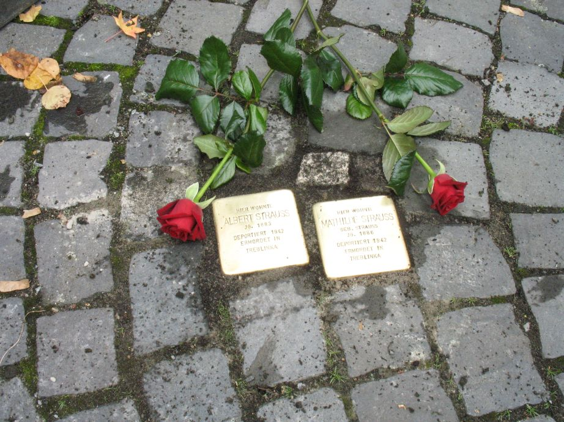

# Albert und Mathilde Strauß

> Albert und Mathilde Strauß (1883 / 1886 –1945) 

> Pfarrgasse 17 Mühlheim 

Albert Strauß wurde am 20.06.1883 in Sprendlingen geboren. Er war Buchdrucker von Beruf. Albert nahm am 1. Weltkrieg in den Jahren von 1915 bis 1918 teil und ist als Pionier abgegangen.

In Sprendlingen war er von 1906 bis 1926 Mitglied im Gesangverein. Er war mit Jenny Morgenstern verheiratet, die jedoch bereits am 08.11.1924 starb. Mit ihr hatte Albert drei Kinder. Irene (*1911), Betty (*1915) und Hedwig (*1920) konnten in die USA flüchten und haben so die Verfolgungen der Nazis überlebt.

1926 zog er nach Mühlheim am Main, wo er am 13.04. Mathilde Strauß heiratete. Mathilde Strauß, geb. Strauß, wurde am 21.07.1886 in Mühlheim am Main geboren. Beide wohnten anschließend im Haus von Mathilde´s Vater, Gerson Strauß, in der Pfarrgasse 17. Hier waren bis zur Weihung der Synagoge in der Friedrichstraße im Jahr 1914 die ersten Gebetsräume der jüdischen Gemeinde untergebracht.

Albert Strauß ging auch in Mühlheim seiner Sangesleidenschaft nach und war von 1926 bis zum Zwangsaustritt im Jahr 1933 Mitglied im Gesangverein „Eintracht“.

Albert und Mathilde besaßen ein kleines Ackergrundstück im Wert von 500 Mrk. Beide wollten, ebenso wie viele Menschen, Nazi-Deutschland verlassen und in die USA ausreisen. Ausreiseanträge nach New York hatten sie schon gestellt.

Prof. Dr. Klaus Werner, der Autor des Buches „Mühlheim am Mein 1933-1945“ führte im Rahmen seiner Recherchen mit der Mühlheimerin Margarethe Kaufmann ein Interview über Mathilde Strauß:

> In der Pfarrgasse hat sie gewohnt. Dort lebte sie mit ihrem Mann, einem Arbeiter. Mathilde Strauß war ein einfacher, stiller, ruhiger Mensch. Wie alle Frauen der Nachbarschaft versorgte sie ihren Mann und ihren Haushalt.

> Ich habe sie gekannt und bin ihr begegnet, als ich noch ein Kind war. Ganz schlank war sie, ihre Haare trug sie geknotet. Ende der Zwanziger und Anfang der Dreißiger Jahre kam sie einmal in der Woche zu uns, um ein Brot zu holen. Meine Eltern verkauften damals Backwaren. Meist kam sie dann in unsere Wohnküche, um sich mit meiner Mutter zu unterhalten.

> Meine Mutter mochte diese freundliche unauffällige Frau gerne. Mir selbst wäre sie weiter gar nicht aufgefallen, denn es kamen damals viele Leute zu uns, wäre nicht ihr freundliches Lächeln, das mir galt, gewesen. Das ist mir von ihr in Erinnerung geblieben. Ein liebes, menschliches Lächeln, das das hagere Gesicht dieser Frau so wunderbar veränderte. Kinder hatte sie keine, aber sie wäre bestimmt eine gute Mutter gewesen. Mutter sein, wenigstens das ist ihr erspart geblieben. Sonst nichts. Sie und ihr Mann waren Juden.

Albert war infolge einer Operation nicht mehr voll arbeitsfähig. Neben Zeiten der Arbeitslosigkeit fand er immer wieder unterschiedliche Anstellungen. So war er u.a. Hilfsarbeiter bei der Gemeinde Mühlheim, Stanzer bei der Firma Druschke (Ledergroßhandlung) in Offenbach, Arbeiter bei den Firmen Johann Eich (Tiefbaugeschäft) und Fischer & Co., beide in Offenbach.

Am 17.09.1942 wurden Albert und seine Frau Mathilde im Rahmen der Aktion Reinhardt, d.h. der nach der Wannseekonferenz organisierten „Endlösung der Judenfrage“, dem Völkermord an den europäischen Juden, mit 16 anderen Mühlheimer Juden unter Bewachung der Gestapo nach Offenbach gebracht. Von Offenbach kamen sie nach Darmstadt und wurde am 30.09.1942 von dort mit 883 Juden ins Generalgouvernement nach Treblinka deportiert. Es ist zu vermuten, dass Albert und Mathilde direkt nach der Ankunft im Vernichtungslager Treblinka ermordet wurde.

Am 17.09.1954 beschloss die Abteilung für Todeserklärungen des Amtsgerichts Offenbach für Albert und Mathilde Strauß den 08.05.1945 als offiziellen Todestag.