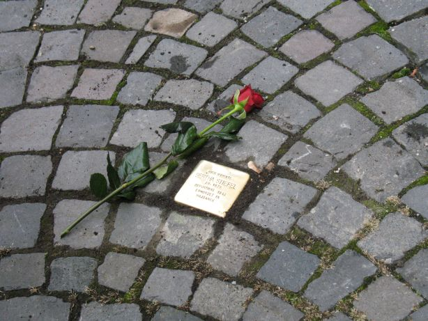

# Bertha Stiefel

> Berta Stiefel (1878 – ?)
> Pfarrgasse 25 Mühlheim 

Bertha Stiefel wurde am 1. April 1878 in Mühlheim am Main geboren. Sie war Hausfrau von Beruf und wohnte in der Pfarrgasse 23.

Sie ging am 7. März 1940 von Mühlheim ins jüdische Altersheim nach Worms, Hintere Judengasse 66. Von dort wurde sie am 19. März 1942 mit 75 weiteren Menschen zum Güterbahnhof in Worms und von dort nach Darmstadt gebracht. Am 20. März 1942 wurde sie mit 1000 Juden von Darmstadt ins „Lager Piaski-Lublin" und von dort ins Konzentrationslager Majdanek deportiert.

Im Buch von Alfred Gottwaldt und Diana Schulle „Die Judendeportationen aus dem Deutschen Reich 1941 – 1945“ wird über den Transport von Darmstadt nach Polen folgendes geschildert:

„Der „Gesellschaftssonderzug zur Beförderung von Arbeitern“ mit der Nummer „Da 14“ war bei der Reichsbahn zu Beginn des Monats März 1942 von Darmstadt nach „Trawniki“ für den 25. März 1942 bestellt; irrig wird dieser Transport mit dem Abmeldedatum vom 20. März 1942 genannt. […] 

In Piaski bei Trawniki lag das einzige geschlossene Ghetto des Kreise Lublin-Land, in dem neben den einheimischen polnischen Juden auch noch die bereits im Februar und März 1940 aus Stettin und Schneidemühl in den Distrikt Lublin deportierten deutschen Juden leben mussten, soweit sie nicht schon verstorben waren. Nur in diesem Fall traf die Angabe „Trawniki“ für den Aussteigeort – nicht das Ziel – der Transporte tatsächlich zu: Da die Ortschaft Piaski keinen eigenen Bahnhof besaß, mussten die für das dortige Ghetto bestimmten Juden im Frühjahr 1942 den Zug auf dem Bahnhof Trawniki verlassen und wurden dann etwa 12 km zu Fuß über die Landstraße in das Durchgangsghetto Piaski geführt. […] 

Darin [im Transport vom 25. März 1942, Anmerkung IG Stolpersteine] wurden Juden aus dem Gebiet des früheren Volksstaates Hessen verschleppt. Aus der Provinz Rheinhessen waren es 466 Menschen aus der Stadt Mainz, 75 aus der Stadt und 15 aus dem Kreis Worms sowie 76 aus dem Kreis Bingen. Aus der Provinz Starkenburg wurden deportiert aus Darmstadt selbst 161 Menschen sowie aus den Kreisen Darmstadt 28, Dieburg 36, Bergstraße 69, Erbach 47, Kreis Groß-Gerau 27. Die Listen im Besitz der Jüdischen Gemeinde Mainz weisen 411 männliche und 589 weibliche Personen aus. 

Das geschlossene Ghetto Piaski im Landkreis Lublin diente ebenso wie Izbica als Durchgangslager in die Vernichtungsstätten des Distrikts Lublin. Schon im Februar und März 1940 waren etwa 1400 deutsche Juden aus Stettin und Schneidemühl deportiert worden, um sie in Piaski, Bełżyce und Glusk anzusiedeln. Viele von ihnen waren bereits gestorben, als Piaski ab März 1942 zu einem Sammelpunkt für Transporte aus dem Reichsgebiet und dem „Protektorat Böhmen und Mähren“ gemacht wurde.

Im März 1942 wurden aus Piaski mehr als 3000 polnische Juden nach Bełżec deportiert; dafür trafen rund 4000 Juden aus dem Reich und dem „Protektorat“ dort ein. Über diese Vorgänge berichtet das bereits 1940 aus Stettin nach Piaski deportierte Ehepaar Max und Martha Bauchwitz in einem Brief vom 25. März 1942 an die Tochter: „Wir sind von 700 etwa noch 150 hier […] Wir stehen noch stark unter dem Eindruck der letzten Tage. E ist wüst leer. Die 1500 aus Mainz, Worms und Darmstadt sind in die Wohnungen der Verreisten gekommen. Sie haben keinen Pfennig Geld! Man erzählt, viele seien unterwegs gestorben.“ Auch drei Postkarten vom April 1942 aus Piaski nach Mainz sind überliefert.

Am 22. Juni 1942 setzten Transporte nach Sobibór ein. Ab Februar 1943 wurde das Ghetto aufgelöst. Die verbliebenen Juden wurden in ein Vernichtungslager gebracht.

Wann genau Bertha Stiefel im Konzentrationslager Majdanek ermordet wurde, ist nicht bekannt