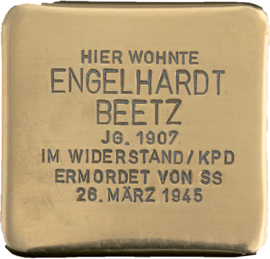

# Engelhard Beetz

> Apfelbaumgasse 5 / Pfarrgasse 8

**Geboren am 17. Juni 1907 - am 26. März 1945 ermordet**

Engelhard Beetz hat in Mühlheim die Volksschule besucht und nach seinem Schulabschluss das Handwerk des Schleifers gelernt. Aus einem Brief wissen wir, dass er sich schon früh mit Fragen des Sozialismus beschäftigte und sich bereits als junger Mann in der Weimarer Republik „mit aller Kraft“, wie es heißt, für Gleichheit und Gerechtigkeit einsetzte.

Auch im Kampf gegen den Faschismus war er aktiv und stand für republikanische Ideale ein.

So folgte er einem Aufruf Gleichgesinnter und ging zum Rathaus, um mit ihnen gemeinsam die Gemeinde und die Institutionen zu schützen, nachdem sich die unter den Nazis Verantwortlichen abgesetzt hatten. Weitere Kämpfe, Blutvergießen und Zerstörungen sollten verhindert und die Verwaltung den heranrückenden Amerikaner geordnet übergeben werden.

„Bei der Ausübung dieses Dienstes“, so heißt es in dem Brief, wurden er und seine Mitstreiter von SS-Angehörigen, die in die Polizeiwache im Rathaus eindrangen, erschossen.

Engelhard Beetz hinterließ seine schwangere Frau und drei Töchterim Alter von 12, 10 und 7 Jahren. Die vierte und jüngste Tochter wurde nach seinem Tod geboren.Er wurde 37 Jahre alt.