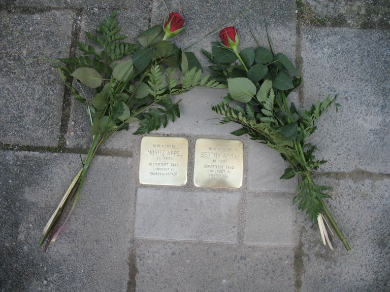

# Bertha Appel und Moritz Appel

> Bertha Appel (1891 –1942) 
> Obermainstr. 13 

Bertha Appel wurde am 26.06.1891 in Dietesheim geboren. Sie war ledig, von Beruf Stepperin und wohnte hier in der Obermainstr. 13.

Am 17. September 1942 wurde sie gemeinsam mit ihrer Schwester Johanna und ihrem Vater Moritz von Dietesheim unter Bewachung der Gestapo nach Offenbach und dann nach Darmstadt gebracht. Den ITS (International Tracing Service) Bad Arolsen, der Verzeichnisse, Karteikarten Deportationslisten u.ä. aus den KZs und anderen offiziellen Stellen, die so weit noch vorhanden und sichergestellt werden konnten, zufolge, wurden Bertha und ihre Schwester Johanna unter der Registriernummer 336 und 337 auf der Deportationsliste aus dem Gestapobereich Darmstadt eingetragen und  am 30.09.1942 in das Generalgouvernement nach Treblinka deportiert.

Bertha Appel erscheint auf der Liste mit dem Geburtsdatum 24.06.1891 in Dietesheim. Über das weitere Schicksal nach dem 30.09.1942 liegen dort keine Informationen vor. Die Familie lebte  im Unterort, im sog. „Welschen Eck“ von Dietesheim und war bekannt und beliebt. Von der inzwischen verstorbenen Frau Marianne Bergmann – eine ehemalige Nachbarin  von Moritz Appel – war zu erfahren, dass Moritz Appel ihr vor seinem Abtransport heimlich ein Päckchen mit einigen Gegenständen u.a. einer kleinen Menora, gegeben hat. Dies sollte ein kleiner Dank von ihm und eine Erinnerung an ihn sein.

> Monika Thomas (stellvertr. Vorsitzende Geschichtsverein Mühlheim am Main)
