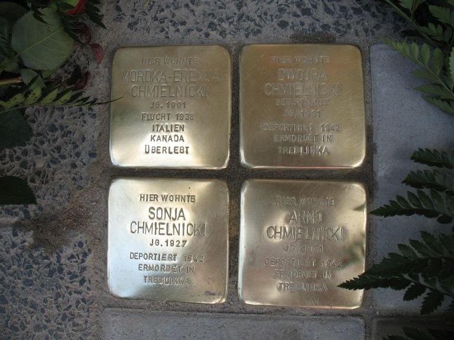

import SteinMap from '@site/src/components/custom/MarkersMap';

# Dwojra, Arno und Sonja Chmielnicki

<SteinMap 
  center={[50.1213124, 8.8352243]}
  markers={[{ position: [50.1213124, 8.8352243], popup: 'Familie Chmielnicki (1901 –1942) - Bahnhofstr. 53 in Mühlheim am Main' }]}
  height="400px"
  width="700px"
  zoom="18"
/>
> Familie Chmielnicki (1901 –1942) - Bahnhofstr. 53 in Mühlheim am Main 

Hier im Haus Bahnhofstraße 53 lebte die vierköpfige jüdische Familie Chmielnicki: Mordka Eremja Chmielnicki und seine Ehefrau Dworja, genannt Dora, sowie ihre beiden Kinder Sonja und Arno. Mordka Eremja überlebte in der Emigration, die drei anderen Familienmitglieder wurden aus Mühlheim deportiert und im Konzentrationslager Treblinka ermordet.

Das Mühlheimer Frauenbündnis hat den Stolperstein für Dora übernommen, die Firma Eduard Geisheimer KG den Stein für den Ehemann, das Kollegium der Goetheschule sponserte den Stein für die Tochter und die Familie Kannwischer den Stolperstein für den Sohn.

## Zeitraum bis 1938 

Mordka Eremja und Dora wurden beide 1901 in Polen geboren - Mordka am 24. September 1901, in Lagow; Dora, geborene Pinkus, am 21. August 1901, in Mrzyglod (das liegt bei Kattowitz). Sie gehörten zu den sogenannten Ostjuden, die aufgrund von wirtschaftlicher Not, politischer Unterdrückung und Pogromen Ende des 19. und Anfang des 20. Jahrhunderts aus Österreich-Ungarn und Russland bzw. deren Nachfolgestaaten Polen, UdSSR und Litauen auswanderten.

Wann Mordka Eremja und Dora nach Deutschland kamen oder ob sie sich vielleicht schon vorher kannten, ist nicht bekannt – jedenfalls haben sie im Alter von 25 Jahren am 3. August 1927 in Mühlheim geheiratet. Dora ist Hausfrau und von Beruf Schneiderin, auch ihr Ehemann ist Schneider. Das erste Kind des Ehepaares, ein Mädchen, das den Namen Sonja erhält, kommt am 24. Oktober 1928 in Frankfurt zur Welt. Drei Jahre später, am 6. November 1931 wird Arno geboren, ebenfalls in Frankfurt.

Wo Sonja 1934 oder 1935 eingeschult wurde, ist unbekannt, denn die Unterlagen der Goetheschule aus den Jahren der Naziherrschaft sind nicht mehr vorhanden. Ohnehin verfügte im September 1935 ein Hessischer Erlass „die möglichst vollständige Rassentrennung für Schüler aller Schularten“ ab dem an Ostern 1936 beginnenden Schuljahr. Beide Kinder besuchten deshalb ab 1. April 1936 die jüdische Bezirksschule in Offenbach. (H.C. Schneider, S. 99/100).

## Emigration von Mordka Eremja 1938 

Das Haus, in dem die Familie Chmielnicki lebte, lag direkt neben der Gaststätte „Braunes Haus“ in der Bahnhofstraße 51, das damalige Parteilokal der  Mühlheimer NSDAP.

Im Buch von H.C. Schneider wird die weitere Entwicklung so zusammengefasst: „Der Schneider Mordka-Eremja Chmielnicki meldet sich am 7. März 1938 ab nach Mailand und bleibt in Zürich. Frau und Kinder sollen bald folgen.“ (S. 45) Zum Zeitpunkt der Emigration ihres Vaters ist Sonja 9 Jahre alt, Arno 6 Jahre.  

Die Hoffnung auf baldige Wiedervereinigung bleibt, wie ein Schreiben des Mühlheimer Bürgermeisters vom 22. Mai 1941 an die Geheime Staatspolizei, Offenbach a.Main zeigt. Darin heißt es: „Der Mordka Eremja Chmielnicki, geb. am 24. September 1901 in Lagow, ist seit März 1938 von Mühlheim fort und befindet sich in Lengnau i.d. Schweiz. Die Ehefrau Dwojra Chmielnicki, geb. Pinkus, geb. am 21. September 1901 in Mrzyglod in Polen, jüdisch, staatenlos, gibt an: Ich habe keinerlei Vermögen und beziehe Wohlfahrts-Unterstützung. Die Einreisegenehmigung nach der Schweiz ist eingereicht. Nach Mitteilung des Ehemannes ist in aller Kürze mit der Genehmigung zu rechnen.“ Dokument zitiert in H.C. Schneider, S. 63.

Dazu kam es nicht mehr, denn ab dem 30. September 1941 war Juden die Auswanderung aus Deutschland verboten. Eine Wiedervereinigung der Familie Chmielnicki war somit nicht mehr möglich. Über das weitere Leben von Mordka Eremja ist lediglich bekannt, dass er 1954 in Mühlheim (H.C. Schneider, S. 104) war und dass er in Kanada lebte (Jörg Neumeister-Jung).

## 1938 bis 1942 Dora versorgt die Familie alleine 

Ab März 1938 muss die 36-jährige Dora sich und ihre Kinder alleine durchbringen. Ihren Schmuck gibt sie Margot Kemmerer im Jahr 1940 zur Aufbewahrung (H.C. Schneider, S. 62), verschiedene Möbelstücke hat sie in der Zeit von 1938 bis 1942 verkauft, wie die Zeitzeugin Anna Spahn 1958 berichtet. Die Familie bezieht Wohlfahrts-Unterstützung von der jüdischen Wohlfahrtsfürsorge. (H.C. Schneider, S. 62) Deren Mittel stammen entweder aus dem aufgelösten Besitz der ehemaligen jüdischen Gemeinden oder aber aus jüdischem Privatvermögen. (Werner, S. 197)

Zeitzeugin Anna Spahn berichtet: „Ungefähr Anfang des Jahres 1942 kam Frau Dora Chmielnicki zu mir und bat mich, einzelne Wäschestücke in Verwahrung zu nehmen. Da eine Ausreise nicht mehr möglich war und das Möbel in Gefahr stand, wollte sie den Rest von Möbel und Wäschestücke an ihr gut bekannte Personen, die nicht der NSDAP angehörten, zur Sicherstellung übergeben, dabei gab sie mir einen Teil ihrer Wäschestücke mit dem Überseekoffer.“ (H.C. Schneider, S. 62)

Aus welchen Gründen Dora und die Kinder im Jahr 1942 ihren Wohnsitz in der Bahnhofstraße 53 aufgeben mussten – ob aus finanziellen Gründen oder weil man die Juden zusammenlegen wollte - ist unbekannt. Zeitzeugin Gretel Schröder, geb. Stiefel, berichtet 1958: „Am 14.9.1942 war ich im Hause Mühlheim/Main, Offenbacher Straße 12 (mein früheres Elternhaus) und besuchte meine dort wohnende Schwester Mathilde. Zu dieser Zeit wohnte auch dort Frau Dora Chmielnicki, an die meine Schwester 2 Räume abtreten musste" ( H.C. Schneider S. 63).

## Deportation 17. September 1942 

Am 17. September 1942 mussten sich 18 Juden aus Mühlheim und Dietesheim mit wenig Gepäck am Rathaus in Mühlheim einfinden, darunter auch Dora, Sonja und Arno Chmielnicki. Sie wurden auf einen Lastwagen aufgeladen und unter Bewachung der Gestapo nach Offenbach gebracht. Hinter der Offenbacher Synagoge befand sich ein freies Gelände, das als Sammelplatz für die zusammengetriebenen Juden diente. (Werner, S. 201, H.C. Schneider, S. 75)

Von Offenbach aus brachte man sie nach Darmstadt in die Justus-Liebig-Schule, dem Sammellager des Volksstaates Hessen. Dort wurden mehr als 2.000 Menschen gefangen gehalten, mit Gewehren bewacht von der Schutzpolizei. In den Klassensälen waren verschiedene Ämter untergebracht, wie Finanzamt, Grundbuchamt, Stadtverwaltung und Gerichtsvollzieher, um sich das Vermögen der Juden zu sichern. (H.C. Schneider, S. 75). Den Angaben der Abwicklungsstelle des Finanzamts Offenbach zufolge wurden die restlichen Möbelstücke von Dora Chmielnicki am 17.9. in Verwahrung genommen und später versteigert (laut  Mirkes/Schild/Schneider, S. 117).

Am 30. September 1942 treten Dora, Sonja und Arno mit einem Transport von 883 Juden die Fahrt ins „Generalgouvernement“ an, wo sie im Vernichtungslager Treblinka ermordet werden. (Neumeister-Jung, S. 71-72).

Der genaue Todestag ist unbekannt, deshalb hat das Amtsgericht Offenbach (Abteilung für Todeserklärungen) am 3. November 1947 den Tag der Deportation, also den 17. September 1942, zum offiziellen Todestag erklärt. Dora Chmielnicki war damals 41 Jahre alt, Tochter Sonja 14 Jahre und Arno zehn Jahre. (Neumeister-Jung, S. 71-72).

> Zitate aus: Hans C. Schneider, Leopold Isaac und die Seinen, April 2000; Jörg Neumeister-Jung, Der jüdische Friedhof in Mühlheim am Main, November 2002; Klaus Werner, Mühlheim am Main 1933-1945, Mühlheim am Main, 1994; Adolf Mirkes, Karl Schild, Hans C. Schneider,  Mühlheim unter den Nazis 1933-1945, Frankfurt am Main, 1983

> Britta Bzyl, Mühlheimer Frauenbündnis
