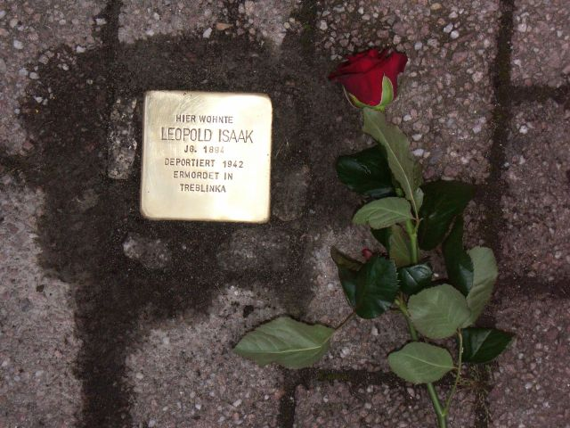

# Leopold Isaak

> Leopold Isaak (1894 – 1942)

> Trachstraße 24 

Als der Vater Liebmann Isaak 1920 stirbt, wird der Sohn im Alter von 25 Jahren zum Ersten Vorsteher der jüdischen Gemeinde von Mühlheim am Main gewählt. Zugleich ist der im Ersten Weltkrieg dekorierte Jude Kantor und Schächter. Im Jahr 1922 heiraten er und Melita Strauß aus Büdesheim, gegen den Widerstand eines Teils ihrer Familien. Sie kaufen das Haus Trachstraße 24 und haben fünf Kinder. Melita führt ein Lebensmittelsgeschäft, er geht noch als Reisender in Tabakwaren und Fetten auf Tour.

Er missachtet lange das Schächtverbot vom März 1933, wird angezeigt und nach Untersuchungshaft von viereinhalb Monaten am 15. August 1935 vom Amtsgericht in Offenbach zu zehn Monaten Gefängnis verurteilt. Fünf Wochen nach Antritt der Haft in Butzbach stürzt er aus dem obersten Stockwerk in den Flur. Der schwer Verletzte kommt ins Krankenhaus und erhält danach Haftverschonung. Honny soit qui mal y pense!

Am Morgen nach der Reichspogromnacht ruft der älteste Sohn aus Offenbach in einem jüdischen Geschäft  in Mühlheim an und lässt den Vater warnen. Der holt die Tora in einem Kinderwagen aus der Synagoge und vergräbt sie im Keller seines Hauses. Am Abend wird er mit anderen jüdischen Männern im alten Wachthäuschen in der Marktstraße eingesperrt. Sie werden schon dort misshandelt und anschließend ins KZ Buchenwald verschleppt.

Von dieser erneuten traumatischen Erfahrung schweigt Leopold Isaak gegenüber seinen Söhnen. Er verkauft das Haus und ein anderes Grundstück, damit seine Frau und die verbliebenen vier Söhne nach Argentinien ausreisen dürfen. Der zweite Sohn ist schon seit Oktober 1938 in den USA in Sicherheit.

Leopold Isaak bleibt zurück, weil er die Reste der jüdischen Gemeinde nicht im Stich lassen will. Verbürgt ist sein Ausspruch: „Die Gemeinde braucht mich!“ Er ist zu seiner Schwester in die Apfelbaumgasse umgezogen. Dort leben Bertha Lehmann und Leopold Isaak in zunehmender Unfreiheit und Vereinsamung, in Not und Angst. Der Schwager ist im Frühjahr 1941 wochenlang verschwunden. Im Sommer desselben Jahres wird Leopold im jüdischen Krankenhaus unterviehischen Bedingungen operiert, weil die nötigen Mittel dazu fehlen und muss wochenlang liegen. Der Schwager Moritz Lehmann stirbt im Mai 1942 im KZ Sachsenhausen und seine Frau Bertha erhält eine Rechnung.

Irgendwann bekommt auch Leopold Isaak mit, dass keine Auswanderung mehr möglich ist. Er muss sich am 17. September 1942 mit seiner Schwester und sechzehn anderen jüdischen Einwohnern aus Mühlheim und Dietesheim hinter dem Rathaus einfinden. Am Sammelpunkt verteilt er Birnen aus seinem alten Garten. Noch vom Lastwagen herunter grüßt er alte Bekannte.

Die Fahrt geht nach Offenbach, in die einstige Synagoge, und von dort nach Darmstadt. In der Justus-Liebig-Schule werden mehr als 2.000 Menschen rund zwei Wochen eingepfercht. Finanzamt, Grundbuchamt und Gerichtsvollzieher plündern die Juden aus. Die Fahrt geht am 30. September weiter nach Treblinka. Aus dem Viehwaggon gehen die Juden direkt in die Gaskammer.