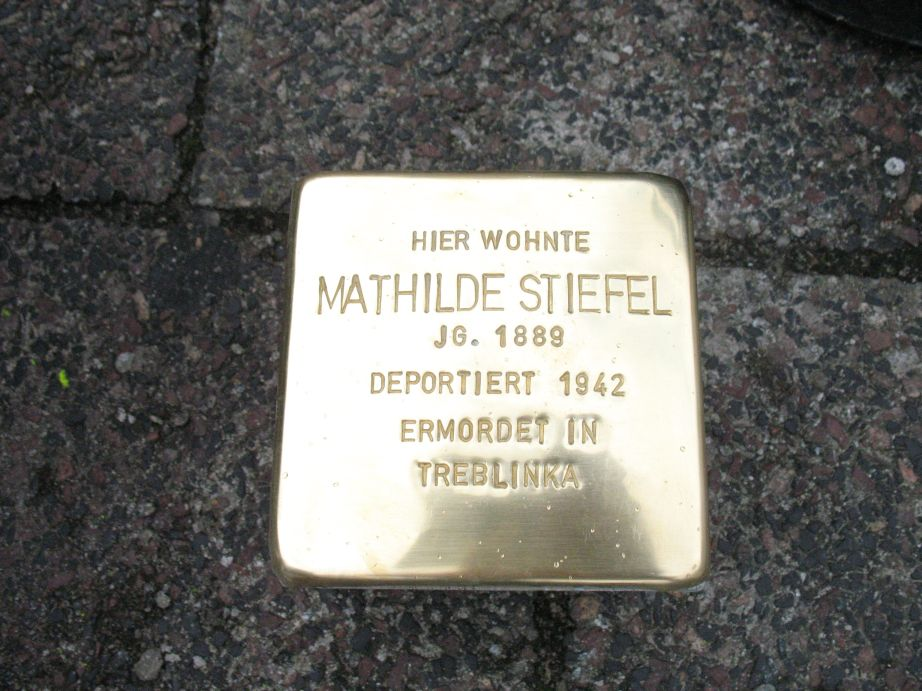

# Mathilde Stiefel

> (1889 –1945)

> Offenbacher Straße 10

Mathilde Stiefel wurde am 23. April 1889 in Mühlheim am Main geboren. Sie war unverheiratet, Schneiderin von Beruf und wohnte in der Offenbacher Straße 10.

Mathilde bekam laut amtlichen Angaben eine Wohlfahrtsunterstützung von 7,50 Mark pro Woche. Sie wollte, wie viele Menschen, Nazi-Deutschland verlassen und in die USA zu ihrer Schwester Magdalena ausreisen. Ihren Ausreiseantrag nach Norfolk in Virgina hatte sie schon gestellt.

Während der Aktion Reinhardt, d.h. im Rahmen der nach der Wannseekonferenz organisierten „Endlösung der Judenfrage", dem Völkermord an den europäischen Juden wurde Mathilde am 17. September 1942 mit 17 anderen Mühlheimer Juden unter Bewachung der Gestapo nach Offenbach gebracht. Von Offenbach kamen sie nach Darmstadt und wurde am 30. September 1942 von dort mit 883 Juden ins Generalgouvernement nach Treblinka deportiert.

Es ist zu vermuten, dass Mathilde direkt nach der Ankunft im Vernichtungslager Treblinka ermordet wurde. Am 19. April 1951 beschloss die Abteilung für Todeserklärungen des Amtsgerichts Offenbach für Mathilde Stiefel den 8. Mai 1945 als offiziellen Todestag.
