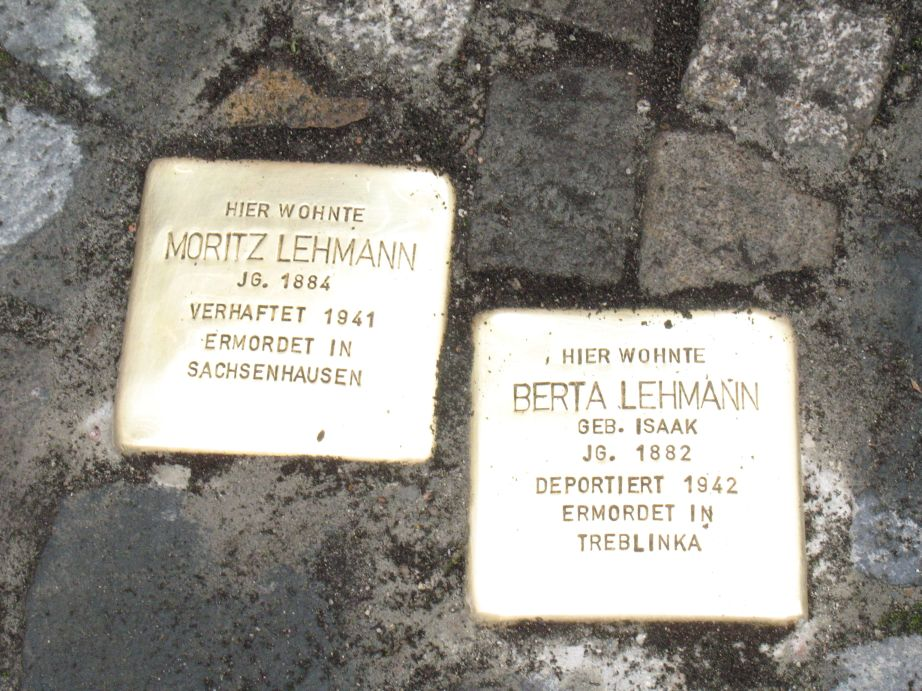

# Moritz und Berta Lehmann

> Apfelbaumgasse 5 Mühlheim 

Moritz Lehmann, wurde am 26. Mai 1884 in Darmstadt als Sohn von Isaak Lehmann und dessen Frau Berta, geb. Neu, geboren. Er war mit Berta Lehmann verheiratet und wohnte in der Apfelbaumgasse 5.

Moritz Lehmann nahm ab 4. Mai 1917 am 1. Weltkrieg teil und wurde am 1. Dezember 1918 als Landsturmmann entlassen.

Moritz Lehmann war Händler von Beruf und handelte laut Verzeichnis der jüdischen Gewerbetreibenden  von 1938 mit Papier und Margarine.

Am 30. April 1941 wurde er durch die Gestapo Offenbach in das Gerichtsgefängnis Offenbach eingeliefert. Er ist im Gefangenenbuch unter der Nummer 30 mit der Kategorie „Schutzhaft" eingetragen. Nach eineinhalb Monaten wurde er am 17. Juni 1941 von dort entlassen bzw. überstellt und ist am 8. Mai 1942, um 04.00 Uhr, im KZ Sachsenhausen „gestorben". Als Todesursache wird Herzschwäche angegeben. Ein Erinnerungsbericht von Emil Büge, eines Häftlings des KZ Sachsenhausen, enthält folgende Zeilen: „Moritz Lehmann, Nr. 40013, Jude, hatte einen Brief nach Palästina geschrieben, dass es ihm nicht gut ging". Dafür hat er vermutlich eine Lagerstrafe erhalten.

Berta Lehmann, geb. Isaak, wurde am 11. Oktober 1882 in Mühlheim am Main als Tochter von Liebmann und Therese Isaak, geb. Adler, geboren. Sie war das zweite der fünf Kinder der Isaaks (Jeanette, Berta, Paulina, Frieda und Leopold). Berta Lehmann war Hausfrau von Beruf. Sie war mit Moritz Lehmann verheiratet und wohnte in der Apfelbaumgasse 5.

Am 17. September 1942 wurde sie gemeinsam mit ihrem Bruder Leopold Isaak von Mühlheim unter Bewachung der Gestapo nach Offenbach gebracht. Von Offenbach kam sie nach Darmstadt und wurde am 30. September 1942 von dort mit 883 Juden ins Generalgouvernement, vermutlich nach Treblinka, deportiert. Dort kam der Zug am 1. Oktober 1942 an. Da das KZ Treblinka ein reines Vernichtungslager war, also ohne angeschlossene Betriebe, ist davon auszugehen, dass alle Deportierten direkt in den Gaskammern ermordet wurden.

Berta und Moritz waren Mitglied in der „israelitischen Religionsgemeinde“ in Mühlheim am Main. Moritz Lehmann war außerdem seit 1937 im Vorstand der Gemeinde.

Leopold Fleischer, der Ehemann von Paulina Isaak, einer Nichte von Berta Lehmann, erinnert sich: 

> So wie ich mich entsinne, hatte Tante Berta Onkel Moritz im Jahr 1932 geheiratet. Sie lebten dann mit meiner Großmutter in der Apfelbaumgasse 5 in Mühlheim. Da sie spät in ihrem Leben geheiratet hatten, waren da keine Kinder.

In einem Brief vom 31. August 1941 schrieben Moritz und Berta Lehmann der ausgewanderten Melitta Isaak, der Frau ihres Bruders Leopold, nach Argentinien folgenden Brief: 

> Meine Lieben! Da schon lange her ist, dass ich Euch geschrieben habe, will [ich] heute auch folglich schreiben.
>
> Leopold ist seit vergangenem Montag wieder zu Hause, und ist es deshalb bei uns wieder etwas lebhafter geworden. Ist eigentlich meine Louise, Frau Rothschild mit Tochter Judith bei ihrem Sohn Arnold dahier eingetroffen und hast du solche, liebe Melli, schon gesprochen? Sie hat auch viele Sorgenzeit mitgemacht, bis sie jetzt an Ort und Stelle angelangt ist.
>
> Hat die Kälte dahier nachgelassen? Wir haben z.Zt. viel Regen und wenig schönes Wetter.
>
> Ich wünsche Euch allen zu den bevorstehenden Feiertagen alles Gute und hoffe, dass alle unsere Wünsche für die Zukunft in Erfüllung gehen. Es ist noch unbestimmt, wie es hier an den Feiertagen ist, ich hoffe jedenfalls, wie im vergangenen Jahr, auch in diesem Jahr wieder in Offenbach zu sein. Eure Kinder scheinen ja alle gut unter zu sein.
>
> Wir denken immer an sie. Das liebe Josefchen scheint ja in der Schule gut voran zu kommen. An Arnold wollen wir heute auch schreiben.
>
> Da ich [meiner] lieben Bertel auch noch Stoff zum Schreiben lassen will, schließe ich heute mit den besten Grüßen von Haus zu Haus, Euer Moritz. Beste Grüße auch von Appel. 

> Liebe Melli und Kinder und Großvater.
>
> Heute Sonntag mittag, nach dem Herr Reis von Bürgel und Moritz Appel von Dietesheim lieben Leopold besucht hatten, so nehme ich mir auch die Zeit, auch meinen Lieben zu schreiben. Mathilde Strauss war heute schon dreimal da, so gibt es immer eine kleine Unterhaltung. Es geht jetzt auf den Herbst zu und die Feiertage kommen immer näher.
>
> Also, meine Lieben wünsche ich euch alles, alles Gute, Gesundheit und seid zufrieden. Ich wollte, ich könnte euch alle mal sehen und besuchen. Es ist aber nicht möglich.
>
> Ich denke doch, dass Liebmann ordentlich und fleißig ist, und auch seinen jüngeren Brüdern vorangeht. Wie ich ja lese in deinem letzten Brief, sind sie ja schon groß und können schon schön mithelfen. Ich will von allen nur Gutes hören, und keine Klagen.
>
> Das kleine Josefchen macht mir viel Spaß. Dem lieben Großvater wünsche ich ein schönes hohes Alter und nur Spaß und vergnügte Tage. Ich will schließen, bleibt alle gesund und auch an deine lieben Geschwister schicke ich Glückwünsche.
>
> Eure Tante

(zitierte Texte überliefert durch H.C. Schneider)
