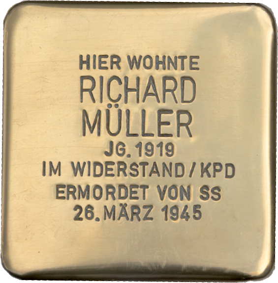

# Karl Richard Müller 

> Pfarrgasse 17 

**Geboren am  14. Oktober 1919 - am 26. März 1945 ermordet**

Von Karl Richard Müller, dem Jüngsten der Getöteten, von Beruf Feintäschner, haben wir keine Angehörigen ausfindig machen können. Es existiert aber ein ausführlicher Bericht seiner Frau Maria Müller aus dem Jahr 1982, in dem einiges über seine Person zu erfahren ist.

Zunächst ist ihr wichtig hervorzuheben: „Mein Mann war gegen den Krieg und das NS-Regime. Als ich ihn kennenlernte, war er Kommunist.”

Er sei im Oktober 1940 einberufen worden. 1941 fand die Heirat statt, in diesem Jahr wurde auch die erste Tochter geboren. 1942 kam er nach Russland. Eine Verwundung am Fuß brachte ihn in ein Lazarett und von dort 1943 in ein Krankenhaus nach Offenbach und schließlich in ambulante Behandlung. Während dieser Zeit konnte er bei seiner Mutter in Mühlheim wohnen. Seine Frau Maria Müller wurde im März 1944 ausgebombt und wurde mit ihrer Tochter in die Nähe von Gießen evakuiert. Zu der Zeit war sie mit ihrem zweiten Kind schwanger. Ihre Tochter kam dort am 20. April 1945 zur Welt.

Laut Frau Müller: „Sie haben dafür gehandelt, dass Mühlheim nicht in Schutt und Asche gelegt wurde. Das haben die Fünf zu Recht gemacht.”

Karl Richard Müller wurde 25 Jahre alt und hinterließ seine Frau Maria, eine dreijährige und eine drei Wochen nach seinem Tod geborene Tochter.