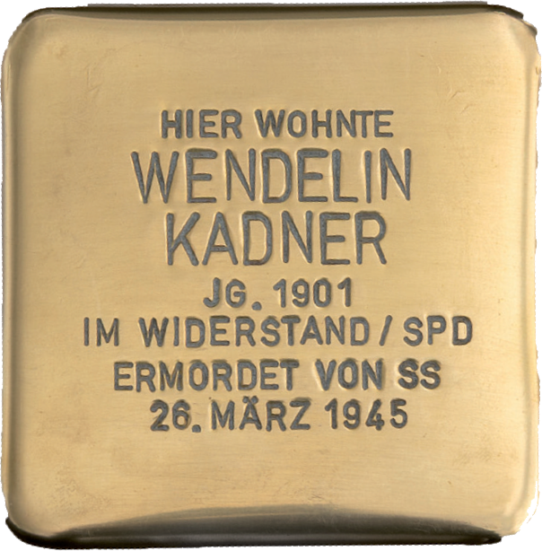

# Wendelin Kadner

> Heinestraße 24

**Geboren am 3. April 1901 - am 26. März 1945 ermordet**

Wendelin Kadner, Mitglied der SPD, gehörte zu den Antifaschisten, die nach der Flucht der NS-Verantwortlichen die Stadtverwaltung in die eigene Hand nahmen. Sie bildeten eine Sicherheitswache, um die Stadt zu schützen und geordnet der heranrückenden US-Armee übergeben zu können.

> Die Bevölkerung hatte weiß geflaggt, Reste deutscher Einheiten zogen sich über den Main zurück. Gegen Abend kamen einige SS-Offiziere, die dann im Hausflur der Polizeiwache stehend, mit Maschinenpistolen in die Wache hineinschossen. Dabei wurden vier Männer getötetund einer schwer verwundet. 

So lesen wir es in einem Schreiben des Bürgermeisters Anton Dey im Oktober 1945.

Einer der Ermordeten war Wendelin Kadner. Er stammte aus einer alteingessenen Mühlheimer Arbeiterfamilie. Mit Schaudern erinnert sich der damals neunjährige Neffe daran, die Leiche seines toten Onkels gesehen zu haben. Die Tochter seines Onkels, so hat er es im Gedächtnis, muss damals 5 oder 6 Jahre alt gewesen sein.

Wendelin Kadner wurde 43 Jahre alt.