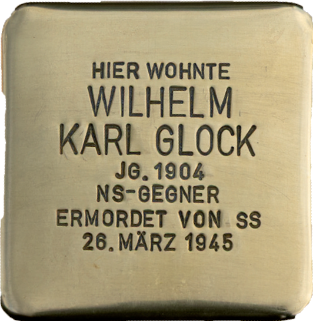

# Wilhelm Karl Glock

> Bahnhofstraße 75

**Geboren am 29. Juni 1904 - am 26. März 1945 ermordet**

Wilhelm Karl Glock war Fahrunternehmer in Mühlheim. Mit einem Traktor und Anhänger hat er Langholz transportiert und war für diese als kriegswichtig eingestufte Tätigkeit von anderen Aufgaben freigestellt. Für seine Arbeit erhielt er eine Schwerstarbeiterzulage.

In den letzten Tagen vor der Ankunft der US-Armee stand sein Traktor in Steinheim am Sägewerk. Um ihn dort abholen zu können, benötigte er eine Genehmigung der städtischen Behörde. Mit dem Fahrrad radelte er zum ehemaligen Rathaus und heutigen Stadtmuseum an der Marktstraße.

Als sein Vater, so der Bericht seines Sohnes, sein Fahrrad abgestellt hatte und das Gebäude betreten wollte, wurde er von hinten von einem aus zwei Männer bestehendem SS-Stoßtrupp erschossen. Nach weiteren Schüssen auf die im Rathaus anwesenden Personen flohen die beiden Schützen nach dem Ruf „Die Amis kommen!” in Richtung Main.

Ein Onkel des jungen Wilhelm Glock konnte in der Pfarrgasse beobachten, wie die Mörder in Richtung Main flohen und dort, so wird erzählt, auf die andere Seite übersetzten.

Wilhelm Karl Glock wurde 40 Jahr alt und hinterließ seine Frau und seinen sechsjährigen Sohn.
