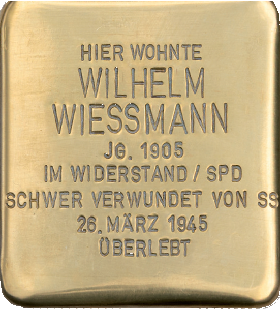

# Wilhelm Wießmann

> Lämmerspieler Straße 81

**Geboren am  5. Februar 1905 - am 26. März 1945 schwer verwundet**

Wilhelm Wießmann hatte nach dem Besuch der Volksschule dasHandwerk des Metzgers erlernt. Er gehörte seit seiner frühesten Jugend der sozialistischen Arbeiterbewegung an. Er war Mitglied des [Reichsbanners](https://de.wikipedia.org/wiki/Reichsbanner_Schwarz-Rot-Gold), eines politischen Wehrverbands zum Schutz der Weimarer Republik. Wießmann war zudem tätiges Mitglied der SPD und bis 1933 Vertreter seiner Partei im Gemeinderat in Mühlheim.

Nach seiner eigenen Schilderung befürwortete er den gemeinsamen Kampf der Arbeiterparteien und ihrer Organisationen gegen den aufkommenden Faschismus. So nahm er auch als Sozialdemokrat an geheimen Zusammenkünften mit der KPD Mühlheim teil.

Am 24. März 1945 wollte sich eine kleine Gruppe um das KPD-Mitglied Willy Busch, dem Organisator einer Stadtwache, im Rathaus besprechen:

:::note[Schilderung von Wilhelm Wießmann]

Ich weiß, dass am 24. März 1945 kaum noch Truppen der Wehrmacht in Mühlheim waren und dass die großen Nazis der Stadt, die vorher noch Durchhalteparolen verbreitet hatten, sich feige abgesetzt hatten.

Das Rathaus war verlassen. Anwesend waren nach meiner Erinnerung Willi Busch, Richard Müller und Engelhard Beetz.

Man besprach, wie man die Stadt vor der Zerstörung schützen könnte. Ich war an der Beseitigung der Panzersperren beteiligt und auch zur Wache eingeteilt und bewaffnet.

Bis zu diesem Montag, dem 26. März, rührte sich in Mühlheim nichts. Ich begab mich zuerst wieder ins Rathaus und dann in die Polizeistation. Dort waren bereits Beetz, Glock, Kadner und Müller versammelt.

Völlig überraschend stürmten etwa gegen 16.00 Uhr SS-Leute, mit Maschinenpistolen bewaffnet, in die Polizeistation. Ohne auch nur ein Wort zu reden, schossen sie auf die im Raum anwesenden Antifaschisten. Ich wurde zuerst am Bein getroffen, bei einer Bewegung nochmals ins Kreuz. Ich stellte mich tot und überlebte den Mordanschlag.

Ich erinnere mich, dass später bekannt wurde, dass dieses SS-Kommando mit einem Kahn von Dörnigheim nach Mühlheim gefahren ist.

:::

Bei dem Mordanschlag der SS auf die Personen im Rathaus wurde Wilhelm Wießmann schwer verletzt, konnte sich jedoch totstellen und so überleben. Seine Verletzungen waren so schwer, dass ihm ein Bein amputiert werden musste. Wilhelm Wießmann hatte einen Sohn. 